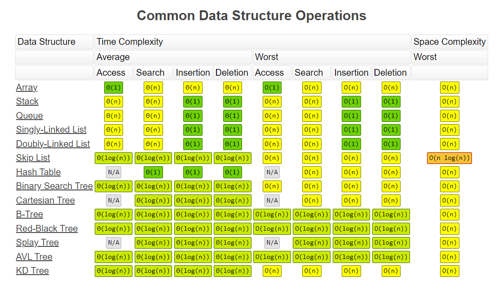
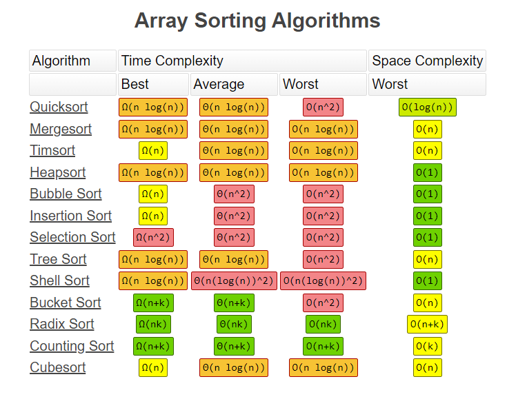
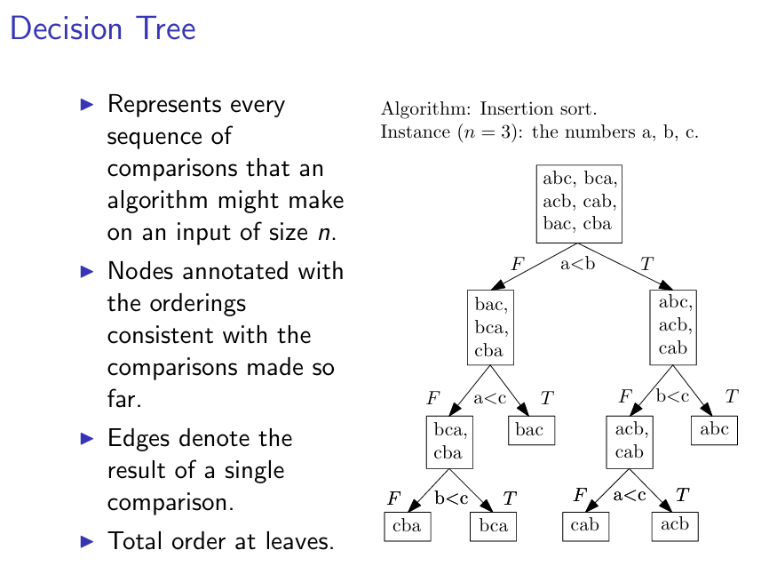

<h1 style="text-align: center;">Data Structure and Algorithm</h1>
<h2 style="text-align: center;">For Interview</h2>
<h3 style="text-align: center;">Hao Ye</h3>

# Data Structure

---

## 0. Time and Space Complexity


---

## 1. Array
An array is a data structure that stores a collection of elements, <u><strong>typically of the same type, arranged in contiguous memory locations, even for dynamic array.</strong></u> Each element in an array is <u><strong>accessed by its index</strong></u>, which represents its position in the array. Arrays are commonly used to store data such as numbers, characters, or other values <u><strong>in a sequential manner.</strong></u>

There are two main types of arrays:

1. **Static Array**: A static array has a fixed size determined at compile-time, meaning that the size of the array <u><strong>cannot be changed once it is declared.</strong></u>

2. **Dynamic Array**: A dynamic array, also known as a resizable array or vector, <u><strong>can dynamically resize itself at runtime</strong></u> to accommodate a varying number of elements. Dynamic arrays offer flexibility by automatically resizing when needed, allowing them to grow or shrink as elements are added or removed.

Arrays are fundamental data structures used in programming for tasks such as storing and accessing data efficiently, implementing algorithms, and representing collections of items. They are widely used in various programming languages and are essential for many algorithms and applications.

### Implement Fixed-sized Array (Array)

```python
import ctypes

class Array(object):
    """
    array implement class
    """
    
    def __init__(self, capacity) -> None:
        self.item_count = 0
        self.array_capacity = capacity
        self.current_index = -1
        self.primary_array = self._create_array(self.array_capacity)
    
    def __len__(self):
        """
        return number of items in array by len(Array)
        """
        return self.item_count
    
    def __str__(self) -> str:
        """
        print the items in array
        """
        if self.item_count == 0:
            return '[]'
        return '[' + ', '.join(map(str, self)) + ']'
    
    def __iter__(self):
        """
        iterable array
        """
        # reinitialize current_index otherwise can only iterate once
        self.current_index = -1  
        return self
    
    def __next__(self):
        """
        get next item
        """
        if self.current_index == self.item_count - 1:
            raise StopIteration
        self.current_index += 1
        return self.primary_array[self.current_index]
    
    def __getitem__(self, item_index):
        """
        return element at index k by Array[k]
        """
        if item_index == -1 and self.item_count != 0:
            return self.primary_array[self.item_count - 1]
        if not 0 <= item_index < self.item_count:
            raise IndexError('Index out of range!')
        return self.primary_array[item_index]
        
    def __setitem__(self, item_index, item):
        """
        change element at index k by Array[k] = item
        """
        if item_index == -1 and self.item_count != 0:
            self.primary_array[self.item_count - 1] = item
            return
        if not 0 <= item_index < self.item_count:
            raise IndexError('Index out of range!')
        self.primary_array[item_index] = item
    
    def _create_array(self, array_capacity):
        """
        create new array with input capacity
        """
        return (array_capacity * ctypes.py_object)()
    
    def size(self):
        """
        return number of items in array by Array.size()
        """
        return self.item_count

    def capacity(self):
        """
        return capacity of array
        """
        return self.array_capacity

    def is_empty(self):
        """
        check whether the array is empty
        """
        return self.item_count == 0
    
    def append(self, item):
        """
        add new item to array, increase capacity if not available
        """
        if self.item_count == self.array_capacity:
            raise TypeError('Full array!')
        self.item_count += 1
        self.primary_array[self.item_count - 1] = item
    
    def insert(self, item, item_index):
        """
        insert item at index
        """
        if not 0 <= item_index <= self.item_count:
            raise IndentationError('Index out of range!')
        
        if self.item_count == self.array_capacity:
            raise TypeError('Full array!')
        
        self.item_count += 1
        index = self.item_count - 1
        while index > item_index:
            self.primary_array[index] = self.primary_array[index - 1]
            index -= 1
        self.primary_array[item_index] = item
    
    def prepend(self, item):
        """
        insert item to the first position
        """
        self.insert(item, 0)
    
    def pop(self):
        """
        remove the last item, return value
        """
        temp = self.primary_array[self.item_count - 1]
        self.item_count -= 1
        return temp
    
    def delete(self, item_index):
        """
        delete element by passing index
        """
        if not 0 <= item_index < self.item_count:
            raise IndexError('Index out of range!')
        while item_index < self.item_count - 1:
            self.primary_array[item_index] = \
                self.primary_array[item_index + 1]
            item_index += 1
        self.item_count -= 1
    
    def remove(self, item):
        """
        remove all the elements that equal to item in array
        """
        i = 0
        while i < self.item_count:
            if self.primary_array[i] == item:
                self.delete(i)
                continue
            i += 1
        
    def find(self, item):
        """
        look for item and return the first index of that item,  
        -1 if not found
        """
        for i in range(self.item_count):
            if self.primary_array[i] == item:
                return i
        return -1
```

### Implement Dynamic Array

```python
import ctypes

class DynamicArray(object):
    """
    dynamic array implement class
    """
    
    def __init__(self) -> None:
        self.item_count = 0
        self.array_capacity = 1
        self.current_index = -1
        self.primary_array = self._create_array(self.array_capacity)
    
    def __len__(self):
        """
        return number of items in array by len(Array)
        """
        return self.item_count
    
    def __str__(self) -> str:
        """
        print the items in array by print(Array)
        """
        if self.item_count == 0:
            return '[]'
        return '[' + ', '.join(map(str, self)) + ']'
    
    def __iter__(self):
        """
        make the array iterable
        """
        # reinitialize current_index otherwise can only iterate once
        self.current_index = -1  
        return self
    
    def __next__(self):
        """
        get next item
        """
        if self.current_index == self.item_count - 1:
            raise StopIteration
        self.current_index += 1
        return self.primary_array[self.current_index]

    def __getitem__(self, item_index):
        """
        return element at index k by Array[k]
        """
        if item_index == -1 and self.item_count != 0:
            return self.primary_array[self.item_count - 1]
        if not 0 <= item_index < self.item_count:
            raise IndexError('Index out of range!')
        return self.primary_array[item_index]

    def __setitem__(self, item_index, item):
        """
        change element at index k by Array[k] = item
        """
        if item_index == -1 and self.item_count != 0:
            self.primary_array[self.item_count - 1] = item
            return
        if not 0 <= item_index < self.item_count:
            raise IndexError('Index out of range!')
        self.primary_array[item_index] = item
    
    def _create_array(self, array_capacity):
        """
        create new array with input capacity
        """
        return (array_capacity * ctypes.py_object)()
    
    def _resize_array(self, new_capacity):
        """
        change the capacity of array
        """
        new_array = self._create_array(new_capacity)
        for i in range(self.item_count):
            new_array[i] = self.primary_array[i]
        self.primary_array = new_array
        self.array_capacity = new_capacity
    
    def size(self):
        """
        return number of items in array by Array.size()
        """
        return self.item_count

    def capacity(self):
        """
        return capacity of array
        """
        return self.array_capacity

    def is_empty(self):
        """
        check whether the array is empty
        """
        return self.item_count == 0
    
    def append(self, item):
        """
        add new item to array, increase capacity if not available
        """
        if self.item_count == self.array_capacity:
            self._resize_array(2 * self.array_capacity)
        self.item_count += 1
        self.primary_array[self.item_count - 1] = item
    
    def insert(self, item, item_index):
        """
        insert item at index
        """
        if not 0 <= item_index <= self.item_count:
            raise IndentationError('Index out of range!')
        
        if self.item_count == self.array_capacity:
            self._resize_array(2 * self.array_capacity)
        
        self.item_count += 1
        index = self.item_count - 1
        while index > item_index:
            self.primary_array[index] = self.primary_array[index - 1]
            index -= 1
        self.primary_array[item_index] = item
    
    def prepend(self, item):
        """
        insert item to the first position
        """
        self.insert(item, 0)
    
    def pop(self):
        """
        remove the last item, return value
        """
        temp = self.primary_array[self.item_count - 1]
        self.item_count -= 1
        if self.item_count == self.array_capacity >> 2:
            self._resize_array(self.array_capacity >> 1)
        return temp
    
    def delete(self, item_index):
        """
        delete element by passing index
        """
        if not 0 <= item_index < self.item_count:
            raise IndexError('Index out of range!')
        while item_index < self.item_count - 1:
            self.primary_array[item_index] = \
                self.primary_array[item_index + 1]
            item_index += 1
        self.item_count -= 1
        if self.item_count == self.array_capacity >> 2:
            self._resize_array(self.array_capacity >> 1)
    
    def remove(self, item):
        """
        remove all the elements that equal to item in array
        """
        i = 0
        while i < self.item_count:
            if self.primary_array[i] == item:
                self.delete(i)
                continue
            i += 1
        if self.item_count == self.array_capacity >> 2:
            self._resize_array(self.array_capacity >> 1)
        
    def find(self, item):
        """
        look for item and return the first index of that item, 
        return -1 if not found
        """
        for i in range(self.item_count):
            if self.primary_array[i] == item:
                return i
        return -1
```

---

## 2. Linked List

A linked list is a data structure commonly used in computer science for storing and manipulating collections of data. <u><strong>It consists of a sequence of elements, called nodes, where each node contains a data value and a reference (or pointer) to the next node in the sequence.</strong></u> Unlike arrays, which store elements in contiguous memory locations, <u><strong>linked lists store elements in non-contiguous memory locations, linked together by pointers.</strong></u>

There are several types of linked lists, including:

1. **Singly Linked List**: In this type of linked list, each node contains a data value and <u><strong>a reference to the next node in the sequence.</strong></u> The last node typically points to null to indicate the end of the list.
2. **Doubly Linked List**: In a doubly linked list, each node contains a data value, <u><strong>a reference to the next node, and a reference to the previous node.</strong></u> This allows traversal of the list in <u><strong>both forward and backward directions.</strong></u> Some people may say insertion or deletion takes $O(1)$ in a doubly linked list. This must be based on the given reference of the target node. In this case, insertion of a singly linked list takes $O(1)$ while deletion takes $O(1)$.
3. **Circular Linked List**: In a circular linked list, <u><strong>the last node points back to the first node, forming a circular structure.</strong></u> This can be <u><strong>either singly or doubly linked.</strong></u>

Linked lists offer several advantages and disadvantages compared to arrays:

**Advantages:**
1. **Dynamic Size**: Linked lists can grow or shrink in size dynamically, unlike static arrays, which have a fixed size.
2. **Efficient Insertion and Deletion**: Insertion and deletion operations can be more efficient in linked lists, <u><strong>especially in the middle of the list</strong></u>, compared to arrays because linked lists do not need to move elements to vacate space for insertion or fill in the vacant space after deletion.
3. **No Wasted Space**: Linked lists use memory efficiently because <u><strong>they only allocate memory for elements as they are added.</strong></u>

**Disadvantages:**
1. **Lack of Random Access**: Unlike arrays, linked lists do not support random access to elements. <u><strong>Accessing an element at a particular index typically requires traversing the list from the beginning.</strong></u>
2. **Extra Memory Overhead**: Linked lists <u><strong>require extra memory for storing pointers/references</strong></u>, which can increase memory usage compared to arrays, especially for small elements.
3. **Sequential Access (Traverse)**: <u><strong>Traversing a linked list sequentially can be slower (sometimes a disaster) than accessing elements in an array</strong></u>, especially for large lists, due to <u><strong>poor cache locality.</strong></u> When data exhibits <u><strong>good cache locality</strong></u>, it means that the data accessed by the program is stored in memory locations that are <u><strong>nearby each other.</strong></u> Moreover, we can use <u><strong>binary search</strong></u> to traverse a sorted array rather than <u><strong>linear search.</strong></u>

### Implement Singly Linked List

```python
class Node(object):
    """
    node implement class
    """
    def __init__(self, data) -> None:
        self.data = data
        self.next = None

class SinglyLinkedList(object):
    """
    singly linked list implement class
    """
    
    def __init__(self) -> None:
        self.head = None
        self.item_count = 0
    
    def __len__(self):
        """
        return number of nodes in singly linked list 
        by len(SinglyLinkedList)
        """
        return self.item_count
    
    def __str__(self) -> str:
        """
        print the data of nodes in singly linked list
        """
        if len(self) == 0:
            return '[]'
        return '[' + ', '.join(map(str, self)) + ']'
    
    def __iter__(self):
        """
        iterable singly linked list
        """
        current = self.head
        while current:
            yield current.data
            current = current.next
    
    def __getitem__(self, index):
        """
        return data of node k by SinglyLinkedList[k]
        """
        if not 0 <= index < len(self):
            raise IndexError('Index out of range!')
        current = self.head
        while index > 0:
            current = current.next
            index -= 1
        return current.data
    
    def __setitem__(self, index, data):
        """
        change data of node k by SinglyLinkedList[k] = item
        """
        if not 0 <= index < len(self):
            raise IndexError('Index out of range!')
        current = self.head
        while index > 0:
            current = current.next
            index -= 1
        current.data = data
    
    def is_empty(self):
        """
        check whether the singly linked list is empty
        """
        return self.item_count == 0
    
    def append(self, data):
        """
        add new node to singly linked list
        """
        self.item_count += 1
        new_node = Node(data)
        if self.head is None:
            self.head = new_node
            return
        current = self.head
        while current.next:
            current = current.next
        current.next = new_node
    
    def prepend(self, data):
        """
        insert node to the first position
        """
        self.item_count += 1
        new_node = Node(data)
        if self.head is None:
            self.head = new_node
            return
        new_node.next = self.head
        self.head = new_node
    
    def insert(self, value, index):
        """
        insert node at index
        """        
        self.item_count += 1
        if not 0 <= index < self.item_count:
            raise IndexError('Index out of range!')
        new_node = Node(value)
        if self.head is None:
            self.head = new_node
            return 
        if index == 0:
            new_node.next = self.head
            self.head = new_node
            return
        current = self.head
        while index > 1:
            current = current.next
            index -= 1
        new_node.next = current.next
        current.next = new_node
    
    def pop(self):
        """
        remove the last node
        """
        if self.head is None:
            return TypeError('Empty linked list!')
        if self.head.next is None:
            current = self.head
            self.head = None
            self.item_count -= 1
            return current.data
        current = self.head
        while current.next is not None:
            temp = current
            current = current.next
        temp.next = None
        self.item_count -= 1
        return current.data
    
    def pop_front(self):
        """
        remove the first node
        """
        if self.head is None:
            return TypeError('Empty linked list!')
        self.item_count -= 1
        temp = self.head.data
        self.head = self.head.next
        return temp
    
    def delete(self, index):
        """
        remove the node by index
        """
        if not 0 <= index < self.item_count:
            raise IndexError('Index out of range!')
        if index == 0:
            self.head = self.head.next
            self.item_count -= 1
            return
        current = self.head
        while index > 1:
            current = current.next
            index -= 1
        current.next = current.next.next
        self.item_count -= 1
    
    def front(self):
        """
        return the data of head
        """
        if self.head is None:
            raise TypeError('Empty linked list!')
        return self.head.data
    
    def back(self):
        """
        return the data of tail
        """
        if self.head is None:
            raise TypeError('Empty linked list!')
        current = self.head
        while current.next:
            current = current.next
        return current.data
    
    def reverse(self):
        """
        reverse the singly linked list
        """
        if self.head is None:
            raise TypeError('Empty linked list!')
        current = None
        new_head = self.head
        while new_head:
            temp = new_head
            new_head = new_head.next
            temp.next = current
            current = temp
        self.head = current
    
    def remove_value(self, value):
        """
        remove the first item in the list with this value
        """
        if self.head is None:
            raise TypeError('Empty linked list!')
        if self.head.data == value:
            self.head = self.head.next
            self.item_count -= 1
            return
        current = self.head
        while current:
            if current.data == value:
                temp.next = current.next
                self.item_count -= 1
                return
            temp = current
            current = current.next
```

### Implement Singly Linked List with Tail Pointer

Roughly the same as the pure singly linked list, except the following:

```python
class SinglyLinkedList_Tail(object):
    """
    singly linked list with tail implement class
    """
    
    def __init__(self) -> None:
        self.head = None
        self.tail = None
        self.item_count = 0

    def append(self, data):
        """
        add new node to singly linked list
        """
        self.item_count += 1
        new_node = Node(data)
        if self.head is None:
            self.head = new_node
            self.tail = new_node
            return
        self.tail.next = new_node
        self.tail = new_node

    def prepend(self, data):
        """
        insert node to the first position
        """
        self.item_count += 1
        new_node = Node(data)
        if self.head is None:
            self.head = new_node
            self.tail = new_node
            return
        new_node.next = self.head
        self.head = new_node

    def insert(self, value, index):
        """
        insert node at index
        """        
        self.item_count += 1
        if not 0 <= index < self.item_count:
            raise IndexError('Index out of range!')
        new_node = Node(value)
        if self.head is None:
            self.head = new_node
            self.tail = new_node
            return 
        if index == 0:
            new_node.next = self.head
            self.head = new_node
            return
        if index == self.item_count - 1:
            self.tail.next = new_node
            self.tail = new_node
            return
        current = self.head
        while index > 1:
            current = current.next
            index -= 1
        new_node.next = current.next
        current.next = new_node

    def pop(self):
        """
        remove the last node
        """
        if self.head is None:
            raise TypeError('Empty linked list!')
        if self.head.next is None:
            current = self.head
            self.head = None
            self.tail = None
            self.item_count -= 1
            return current.data
        current = self.head
        while current.next is not None:
            temp = current
            current = current.next
        temp.next = None
        self.tail = temp
        self.item_count -= 1
        return current.data

    def pop_front(self):
        """
        remove the first node
        """
        if self.head is None:
            raise TypeError('Empty linked list!')
        self.item_count -= 1
        temp = self.head.data
        self.head = self.head.next
        if self.head is None:
            self.tail = None
        return temp
    
    def delete(self, index):
        """
        remove the node by index
        """
        if not 0 <= index < self.item_count:
            raise IndexError('Index out of range!')
        if index == 0:
            self.head = self.head.next
            self.item_count -= 1
            if self.head is None:
                self.tail = None
            return
        current = self.head
        while index > 1:
            current = current.next
            index -= 1
        if current.next == self.tail:
            self.tail = current
        current.next = current.next.next
        self.item_count -= 1

    def front(self):
        """
        return the data of head
        """
        if self.head is None:
            raise TypeError('Empty linked list!')
        return self.head.data
    
    def back(self):
        """
        return the data of tail
        """
        if self.head is None:
            raise TypeError('Empty linked list!')
        return self.tail.data
        
    def reverse(self):
        """
        reverse the singly linked list
        """
        if self.head is None:
            raise TypeError('Empty linked list!')
        self.tail = self.head
        current = None
        new_head = self.head
        while new_head:
            temp = new_head
            new_head = new_head.next
            temp.next = current
            current = temp
        self.head = current
    
    def remove_value(self, value):
        """
        remove the first item in the singly linked list with this value
        """
        if self.head is None:
            raise TypeError('Empty linked list!')
        if self.head.data == value:
            self.head = self.head.next
            self.item_count -= 1
            if self.head is None:
                self.tail = None
            return
        current = self.head
        while current:
            if current.data == value:
                if current == self.tail:
                    self.tail = temp
                temp.next = current.next
                self.item_count -= 1
                return
            temp = current
            current = current.next
```

**Remark:** Comparing with the original singly linked list, a singly linked list with a tail pointer has $O(1)$ time complexity while inserting into the tail instead of $O(n)$. Apart from that, they all share $O(1)$ time complexity for inserting or deleting at the head, $O(n)$ time complexity for inserting or deleting in the middle, and $O(n)$ time complexity for deleting at the tail due to traversing.

### Implement Doubly Linked List

```python
class Node_(object):
    """
    node implement class
    """
    def __init__(self, data) -> None:
        self.data = data
        self.prev = None
        self.next = None

class DoublyLinkedList(object):
    """
    doubly linked list implement class
    """
    
    def __init__(self) -> None:
        self.head = None
        self.tail = None
        self.item_count = 0
        
    def __len__(self):
        """
        return number of nodes in doubly linked list
        """
        return self.item_count
    
    def __str__(self) -> str:
        """
        print the data of nodes in doubly linked list
        """
        if len(self) == 0:
            return '[]'
        return '[' + ', '.join(map(str, self)) + ']'
    
    def __iter__(self):
        """
        iterable doubly linked list
        """
        current = self.head
        while current:
            yield current.data
            current = current.next
    
    def __getitem__(self, index):
        """
        return data of node k by DoublyLinkedList[k]
        """
        if not 0 <= index < len(self):
            raise IndexError('Index out of range!')
        current = self.head
        while index > 0:
            current = current.next
            index -= 1
        return current.data
    
    def __setitem__(self, index, data):
        """
        change data of node k by DoublyLinkedList[k] = item
        """
        if not 0 <= index < len(self):
            raise IndexError('Index out of range!')
        current = self.head
        while index > 0:
            current = current.next
            index -= 1
        current.data = data
    
    def is_empty(self):
        """
        check whether the doubly linked list is empty
        """
        return self.item_count == 0
    
    def append(self, data):
        """
        add new node to doubly linked list
        """
        self.item_count += 1
        new_node = Node_(data)
        if self.head is None:
            self.head = new_node
            self.tail = new_node
            return
        self.tail.next = new_node
        new_node.prev = self.tail
        self.tail = new_node
    
    def prepend(self, data):
        """
        insert node to the first position
        """
        self.item_count += 1
        new_node = Node_(data)
        if self.head is None:
            self.head = new_node
            self.tail = new_node
            return
        new_node.next = self.head
        self.head.prev = new_node
        self.head = new_node
    
    def insert(self, value, index):
        """
        insert node at index
        """        
        self.item_count += 1
        if not 0 <= index < self.item_count:
            raise IndexError('Index out of range!')
        new_node = Node_(value)
        if self.head is None:
            self.head = new_node
            self.tail = new_node
            return 
        if index == 0:
            new_node.next = self.head
            self.head.prev = new_node
            self.head = new_node
            return
        if index == self.item_count - 1:
            self.tail.next = new_node
            new_node.prev = self.tail
            self.tail = new_node
            return
        current = self.head
        while index > 1:
            current = current.next
            index -= 1
        new_node.next = current.next
        current.next.prev = new_node
        current.next = new_node
        new_node.prev = current
        
    def pop(self):
        """
        remove the last node
        """
        if self.head is None:
            raise TypeError('Empty linked list!')
        if self.head.next is None:
            current = self.head
            self.head = None
            self.tail = None
            self.item_count -= 1
            return current.data
        current = self.head
        while current.next is not None:
            temp = current
            current = current.next
        temp.next = None
        self.tail = temp
        self.item_count -= 1
        return current.data
    
    def pop_front(self):
        """
        remove the first node
        """
        if self.head is None:
            raise TypeError('Empty linked list!')
        self.item_count -= 1
        temp = self.head.data
        self.head = self.head.next
        if self.head is None:
            self.tail = None
        else:
            self.head.prev = None
        return temp
    
    def delete(self, index):
        """
        remove the node by index
        """
        if not 0 <= index < self.item_count:
            raise IndexError('Index out of range!')
        if index == 0:
            self.head = self.head.next
            self.item_count -= 1
            if self.head is None:
                self.tail = None
            else:
                self.head.prev = None
            return
        current = self.head
        while index > 1:
            current = current.next
            index -= 1
        if current.next == self.tail:
            self.tail = current
            current.next = current.next.next
        else:
            current.next = current.next.next
            current.next.prev = current
        self.item_count -= 1
    
    def front(self):
        """
        return the data of head
        """
        if self.head is None:
            raise TypeError('Empty linked list!')
        return self.head.data
    
    def back(self):
        """
        return the data of tail
        """
        if self.head is None:
            raise TypeError('Empty linked list!')
        return self.tail.data
    
    def reverse(self):
        """
        reverse the doubly linked list
        """
        if self.head is None:
            raise TypeError('Empty linked list!')
        self.tail = self.head
        current = None
        new_head = self.head
        while new_head:
            temp = new_head
            new_head = new_head.next
            temp.prev = temp.next
            temp.next = current
            current = temp
        self.head = current
    
    def remove_value(self, value):
        """
        remove the first item in the doubly linked list with this value
        """
        if self.head is None:
            raise TypeError('Empty linked list!')
        if self.head.data == value:
            self.head = self.head.next
            self.item_count -= 1
            if self.head is None:
                self.tail = None
            else:
                self.head.prev = None
            return
        current = self.head
        while current:
            if current.data == value:
                if current == self.tail:
                    self.tail = temp
                else:
                    current.next.prev = temp
                temp.next = current.next
                self.item_count -= 1
                return
            temp = current
            current = current.next
```

### Implement Circular Linked List

```python
pass
```

### Implement Doubly Circular Linked List

```python
pass
```

---

## 3. Stack

Stack is a data structure that operates on a <u><strong>last-in, first-out (LIFO)</strong></u> principle. It is a collection of elements with two primary operations: push and pop.

1. **Push**: This operation adds an element to the top of the stack.
2. **Pop**: This operation removes the top element from the stack.

Additional operations might include peek or top, which allows you to view the top element without removing it, and isEmpty, which checks if the stack is empty.

Stacks are used in various algorithms and applications, including expression evaluation, parsing, <u><strong>backtracking, memory management, and undo mechanisms</strong></u> in applications.

In terms of implementation, stacks can be realized using various data structures such as arrays, linked lists, or dynamic arrays (like Python lists). They are efficient for operations at the top of the stack but less efficient for operations at arbitrary positions.

**Remark:** The stack in data structures is not related to the stack memory area!

**Stack Memory and Heap Memory**

Stack memory and heap memory are two distinct regions of memory in computer systems, serving different purposes and managed in different ways:

1. **Purpose:**

   - **Stack Memory:** Primarily used for storing <u><strong>local variables, function parameters, return addresses, and other function call-related information</strong></u>. It's a structured memory region that follows the <u><strong>Last-In, First-Out (LIFO)</strong></u> principle.
   - **Heap Memory:** Used for <u><strong>dynamic memory allocation</strong></u>, where memory is <u><strong>allocated and deallocated manually during program execution.</strong></u> Heap memory is more flexible in size and lifetime than stack memory.

2. **Lifetime:**

   - **Stack Memory:** Variables and data allocated on the stack have a <u><strong>limited lifetime tied to the execution of the function</strong></u> in which they are declared. They are <u><strong>automatically deallocated when the function terminates.</strong></u>
   - **Heap Memory:** Memory allocated on the heap persists <u><strong>until explicitly deallocated by the programmer</strong></u>. Its lifetime is not tied to any specific function or block of code.

3. **Access:**

   - **Stack Memory:** Accessing data on the stack is <u><strong>fast and efficient, as it involves simple pointer manipulation</strong></u>. However, the size of stack memory is typically limited.
   - **Heap Memory:** Accessing data on the heap can be <u><strong>slower than on the stack due to dynamic memory allocation overhead (bad cache locality)</strong></u>. However, heap memory offers more flexibility in terms of size and lifetime.

In summary, stack memory is used for managing function call contexts and local variables, with automatic management by the system. Heap memory, on the other hand, is used for dynamic memory allocation and requires manual management by the programmer.

### Implement Stack with Array

```python
class StackUsingArray(object):
    """
    stack implement class with array
    """
    
    def __init__(self) -> None:
        self.stack = Array()
    
    def __len__(self):
        """
        return number of items in stack
        """
        return self.stack.item_count
    
    def __str__(self) -> str:
        """
        print the items in stack, the rightmost is the peek
        """
        if self.stack.item_count == 0:
            return '[]'
        return '[' + ', '.join(map(str, self.stack)) + ']'

    def push(self, item):
        """
        push item into stack
        """
        self.stack.append(item)
    
    def pop(self):
        """
        remove the item at the top of stack, return value
        """
        return self.stack.pop()

    def peek(self):
        """
        return the item at the top of stack without removing 
        """
        if self.is_empty():
            raise TypeError('Empty Stack!')
        return self.stack[-1]
    
    def is_empty(self):
        """
        check whether the stack is empty
        """
        return self.stack.is_empty()
    
    def count(self):
        """
        return total number of items in stack
        """
        return self.stack.item_count
    
    def change(self, item, item_index):
        """
        change the item at given position, 
        where the peek has index self.count() - 1
        """
        self.stack[self.count() - 1 - item_index] = item
```

### Implement Stack with Linked List

```python
class StackUsingList(object):
    """
    stack implement class with linked list
    """
    
    def __init__(self) -> None:
        self.stack = SinglyLinkedList()
    
    def __len__(self):
        """
        return number of items in stack
        """
        return self.stack.item_count
    
    def __str__(self) -> str:
        """
        print the items in stack, the leftmost is the peek
        """
        if self.stack.item_count == 0:
            return '[]'
        return '[' + ', '.join(map(str, self.stack)) + ']'

    def push(self, item):
        """
        push item into stack
        """
        self.stack.prepend(item)
    
    def pop(self):
        """
        remove the item at the top of stack, return value
        """
        return self.stack.pop_front()

    def peek(self):
        """
        return the item at the top of stack without removing   
        """
        if self.is_empty():
            raise TypeError('Empty Stack!')
        return self.stack.front()
    
    def is_empty(self):
        """
        check whether the stack is empty
        """
        return self.stack.is_empty()
    
    def count(self):
        """
        return total number of items in stack
        """
        return self.stack.item_count
    
    def change(self, item, item_index):
        """
        change the item at given position
        """
        self.stack[item_index] = item
```

**Remark:** While implementing a stack with a linked list, since accessing in a linked list is $O(n)$ due to linear search, we use the head node as the stack peek to avoid traversing the list during popping and pushing.

---

## 4. Queue

### Implement Queue with Array

```python
pass
```

### Implement Queue with Singly Linked List with Tail Pointer

```python
class QueueUsingSinglyLinkedList(object):
    """
    Implement Queue with Singly Linked List with Tail Pointer
    """
    
    def __init__(self) -> None:
        self.queue = SinglyLinkedList_Tail()
    
    def __len__(self):
        """
        return the length of queue
        """
        return len(self.queue)
    
    def __str__(self) -> str:
        """
        print the items in queue, left is queue front
        """
        if self.queue.is_empty():
            return '[]'
        return '[' + ', '.join(map(str, self.queue)) + ']'
    
    def __iter__(self):
        """
        iterable queue
        """
        return self.queue.__iter__()
            
    def __getitem__(self, index):
        """
        return item of k-th least recently added item
        """
        return self.queue[index]
           
    def enqueue(self, item):
        """
        add new element into queue
        """
        self.queue.append(item)
        
    def dequeue(self):
        """
        remove the first element in queue
        """
        if self.queue.is_empty():
            raise TypeError('Empty queue!')
        return self.queue.pop_front()
        
    def empty(self):
        """
        clear the queue
        """   
        self.queue.head = None
        self.queue.tail = None
        self.queue.item_count = 0
```

### Implement Queue with Doubly Linked List

```python
pass
```

### Implement Amortized Queue with Two Singly Linked Lists

```python
pass
```

### Implement Real-time Queue

```python
pass
```

---

## 5. Tree

### 5.1 Binary Tree

#### Implement Binary Tree

```python
class TreeNode(object):
    """
    tree node implementation
    """
    def __init__(self, key) -> None:
        self.val = key
        self.left = None
        self.right = None

class BinaryTree(object):
    """
    binary tree implementation
    """
    def __init__(self, root_key) -> None:
        self.root = TreeNode(root_key)
    
    def insert(self, key):
        # Level order insertion (BFS)
        queue = [self.root]
        
        while queue:
            temp = queue.pop(0)
            
            if not temp.left:
                temp.left = TreeNode(key)
                break
            else:
                queue.append(temp.left)
            
            if not temp.right:
                temp.right = TreeNode(key)
                break
            else:
                queue.append(temp.right)
        
    def level_order_traversal(self):
        queue = [self.root]
            
        while queue:
            temp = queue.pop(0)
            print(temp.val, end=' ')
            
            if temp.left:
                queue.append(temp.left)
            if temp.right:
                queue.append(temp.right)
        print()
    
    def in_order_traversal(self):
        def in_order(root):
            if root:
                in_order(root.left)
                print(root.val, end=' ')
                in_order(root.right)
        in_order(self.root)
        print()
    
    def pre_order_traversal(self):
        def pre_order(root):
            if root:
                print(root.val, end=' ')
                pre_order(root.left)
                pre_order(root.right)
        pre_order(self.root)
        print()
        
    def post_order_traversal(self):
        def post_order(root):
            if root:
                post_order(root.left)
                post_order(root.right)
                print(root.val, end=' ')
        post_order(self.root)
        print()
```

#### 5.1.1 BFS

Keep in mind that BFS uses a queue to implement. The time complexity is $O(n)$ and space complexity is $O(1)$ in the best case (every node has exactly one child) and is $O(n)$ in the worst case.

**Pseudocode (BST)**

```python
def BFS(root):
    queue = []
    queue.append(root)

    while queue:
        node = queue.pop(0)
        print(node, end = ' ')

        if node.left:
            queue.append(node.left)
        if node.right:
            queue.append(node.right)
```

**Pseudocode (Graph)**

```python
def BFS(graph, node):
    visited = []
    queue = []

    visited.append(node)
    queue.append(node)

    while queue:
        s = queue.pop(0)
        print(s, end = ' ')

        for n in tree(s):
            if n not in visited:
                queue.append(n)
                visited.append(n)
```

#### 5.1.2 DFS

Keep in mind that DFS uses a stack to implement. The time complexity is $O(n)$ and space complexity is $O(\log(n))$ in the best case (average height of a BST) and is $O(n)$ in the worst case. There are three types of traversals: inorder (DFS: left, self, right), postorder (DFS: left, right, self), preorder (DFS: self, left, right).

**Pseudocode (Binary Tree, Preorder)**

```python
def dfs(root):
    if root:
        print(root.val)
        dfs(root.left)
        dfs(root.right)
```

**Pseudocode (Binary Tree, Preorder with Stack)**

```python
def dfs(root):
    stack = [root]

    while stack:
        temp = stack.pop()
        print(temp.val)
        if temp.right:
            stack.append(temp.right)
        if temp.left:
            stack.append(temp.left)
```

**Pseudocode (Graph)**

```python
def DFS(graph, node):
    visited = []
    stack = deque()

    visited.append(node)
    stack.append(node)

    while stack:
        # preorder
        s = stack.pop()
        print(s, end = ' ')

        for n in reverse(tree[s]):
            if n not in visited:
                stack.append(n)
                visited.append(n)       
```

### 5.2 Binary Search Tree (BST)

#### Implement Binary Search Tree
```python
class TreeNode:
    def __init__(self, key):
        self.key = key
        self.left = None
        self.right = None

class BST:
    def __init__(self):
        self.root = None
    
    def insert(self, key):
        if self.root is None:
            self.root = TreeNode(key)
        else:
            self._insert(self.root, key)
            
    def _insert(self, node, key):
        if key <= node.key:
            if node.left is None:
                node.left = TreeNode(key)
            else:
                self._insert(node.left, key)
        else:
            if node.right is None:
                node.right = TreeNode(key)
            else:
                self._insert(node.right, key)
    
    def get_node_count(self):
        return self._get_node_count(self.root)
        
    def _get_node_count(self, node):
        if not node:
            return 0
        else:
            return 1 + self._get_node_count(node.left) + \
                self._get_node_count(node.right)
    
    def is_in_tree(self, key):
        return self._is_in_tree(self.root, key)
    
    def _is_in_tree(self, node, key):
        if not node:
            return False
        if key == node.key:
            return True
        elif key < node.key:
            return self._is_in_tree(node.left, key)
        else:
            return self._is_in_tree(node.right, key)
    
    def level_order_traversal(self):
        if not self.root:
            return None
        
        result = []
        queue = [self.root]
        while queue:
            node = queue.pop(0)
            result.append(node.key)
            if node.left:
                queue.append(node.left)
            if node.right:
                queue.append(node.right)
        return result
    
    def in_order_traversal(self):
        result = []
        self._in_order_traversal(self.root, result)
        return result
    
    def _in_order_traversal(self, node, result):
        # When you pass a list to a function, you are passing a reference 
        # to the same list object, not a copy of it. 
        # As a result, any modifications made to the list inside the 
        # function will affect the original list outside the function.
        if node:
            self._in_order_traversal(node.left, result)
            result.append(node.key)
            self._in_order_traversal(node.right, result)

    def pre_order_traversal(self):
        result = []
        self._pre_order_traversal(self.root, result)
        return result
    
    def _pre_order_traversal(self, node, result):
        if node:
            result.append(node.key)
            self._pre_order_traversal(node.left, result)
            self._pre_order_traversal(node.right, result)

    def post_order_traversal(self):
        result = []
        self._post_order_traversal(self.root, result)
        return result
    
    def _post_order_traversal(self, node, result):
        if node:
            self._post_order_traversal(node.left, result)
            self._post_order_traversal(node.right, result)
            result.append(node.key)
    
    def print_values(self):
        print(self.in_order_traversal())
    
    def get_min_iterative(self):
        if not self.root:
            return None
        temp = self.root
        while temp.left:
            temp = temp.left
        return temp.key

    def get_min_recursive(self):
        return self._get_min_recursive(self.root)
    
    def _get_min_recursive(self, node):
        if not node:
            return None
        if not node.left:
            return node.key
        else:
            return self._get_min_recursive(node.left)
    
    def get_max_iterative(self):
        if not self.root:
            return None  
        temp = self.root
        while temp.right:
            temp = temp.right
        return temp.key

    def get_max_recursive(self):
        return self._get_max_recursive(self.root)
    
    def _get_max_recursive(self, node):
        if not node:
            return None
        if not node.right:
            return node.key
        else:
            return self._get_max_recursive(node.right)
        
    def get_height(self):
        return self._get_height(self.root)
    
    def _get_height(self, node):
        if not node:
            return -1
        return 1 + max(self._get_height(node.left), self._get_height(node.right))
    
    def is_binary_search_tree(self):
        return self._is_binary_search_tree(self.root, float('-inf'), float('inf'))
    
    def _is_binary_search_tree(self, node, minValue, maxValue):
        if not node:
            return True
        if (node.key > minValue and 
            node.key <= maxValue and 
            self._is_binary_search_tree(node.left, minValue, node.key) and
            self._is_binary_search_tree(node.right, node.key, maxValue)):
            return True
        else:
            return False
        
    def delete(self, key):
        self.root = self._delete(self.root, key)
        
    def _delete(self, root, key):
        if not root:
            return root
        if key < root.key:
            root.left = self._delete(root.left, key)
        elif key > root.key:
            root.right = self._delete(root.right, key)   
        else:
            # case 1: No Child
            if not root.left and not root.right:
                return None
            # case 2: One Child
            elif not root.left and root.right:
                return root.right
            elif root.left and not root.right:
                return root.left 
            # case 3: Two Children
            node = self._get_min_val_node(root.right)
            root.key = node.key
            root.right = self._delete(root.right, node.key)
        return root
        
    def _get_min_val_node(self, node):
        temp = node
        while temp.left:
            temp = temp.left 
        return temp
    
    def get_successor(self, key):
        if not self.is_in_tree(key) or key == self.get_max_recursive():
            return None
        node = self.get_node(key)
        # case 1: Node has right subtree
        if node.right:
            temp = self._get_min_val_node(node.right)
            return temp.key
        # case 2: No right subtree
        else:
            parent = self._get_parent(node)
            return parent.key
        
    def get_node(self, key):
        return self._get_node(self.root, key)
    
    def _get_node(self, node, key):
        if not node:
            return None
        if key == node.key:
            return node
        elif key < node.key:
            return self._get_node(node.left, key)
        elif key > node.key:
            return self._get_node(node.right, key)
    
    def _get_parent(self, node):
        if not node or node == self.root:
            return None
        else:
            parent = None
            child = self.root
            while child != node:
                parent = child
                if node.key < child.key:
                    child = child.left
                elif node.key > child.key:
                    child = child.right
            return parent
```

### 5.3 Self-Balanced Binary Search Tree

#### 5.3.1 AVL Tree

The oldest type of self-balanced BST. The AVL property is stricter than other self-balanced BSTs, making the height of an AVL tree smaller ($h \in O(1.44\log(n))$). Consequently, insertion and deletion can be slower in AVL due to more rotations, while search is faster due to smaller tree height.

**AVL Property**

- Height Property: For any node in the AVL tree, the heights of its left and right subtrees differ by at most 1.
- Balance Property: For any node in the AVL tree, the balance factor is defined as the difference between the heights of its left and right subtrees. The balance factor of a node must be either -1, 0, or 1.

**AVL Rotations**


##### Implement AVL Tree

```python
class Node:
    def __init__(self, value):
        self.value = value
        self.left = None
        self.right = None
        self.height = 0
        
class AVLTree:
    def __init__(self):
        self.root = None
    
    def _get_height(self, node):
        if not node:
            return -1
        return node.height
    
    def _balance_factor(self, node):
        if not node:
           return 0
        return self._get_height(node.left) - self._get_height(node.right)

    def _left_rotate(self, x):
        y = x.right
        B = y.left 
        
        x.right = B
        y.left = x
         
        x.height = 1 + max(self._get_height(x.left), self._get_height(x.right))
        y.height = 1 + max(self._get_height(y.left), self._get_height(y.right))
        
        return y
    
    def _right_rotate(self, x):
        y = x.left 
        B = y.right
        
        x.left = B 
        y.right = x 
        
        x.height = 1 + max(self._get_height(x.left), self._get_height(x.right))
        y.height = 1 + max(self._get_height(y.left), self._get_height(y.right))
        
        return y 
    
    def _left_right_rotate(self, x):
        x.left = self._left_rotate(x.left)
        return self._right_rotate(x)
    
    def _right_left_rotate(self, x):
        x.right = self._right_rotate(x.right)
        return self._left_rotate(x)
    
    def _fix_AVL(self, node):
        balance_factor_x = self._balance_factor(node)
        
        if balance_factor_x > 1:
            balance_factor_y = self._balance_factor(node.left)
            if balance_factor_y >= 0:
                return self._right_rotate(node)
            else:
                return self._left_right_rotate(node)
        elif balance_factor_x < -1:
            balance_factor_y = self._balance_factor(node.right)
            if balance_factor_y <= 0:
                return self._left_rotate(node)
            else:
                return self._right_left_rotate(node)
        return node
        
    def insert(self, value):
        self.root = self._insert(self.root, value)
    
    def _insert(self, node, value):
        if not node:
            return Node(value)
        elif value <= node.value:
            node.left = self._insert(node.left, value)
        else:
            node.right = self._insert(node.right, value)
        
        node.height = 1 + max(self._get_height(node.left), \
            self._get_height(node.right))
        return self._fix_AVL(node)
    
    def delete(self, value):
        self.root = self._delete(self.root, value)
    
    def _delete(self, node, value):
        if not node:
            return None
        elif value < node.value:
            node.left = self._delete(node.left, value)
        elif value > node.value:
            node.right = self._delete(node.right, value)
        else:
            # case 1: No Child
            if not node.left and not node.right:
                return None
            # case 2: One Child
            elif not node.left and node.right:
                return node.right
            elif node.left and not node.right:
                return node.left
            # case 3: Two Children
            temp = self._get_min_val_node(node.right)
            node.value = temp.value
            node.right = self._delete(node.right, temp.value)
            
        node.height = 1 + max(self._get_height(node.left), \
            self._get_height(node.right))   
        return self._fix_AVL(node)

    def _get_min_val_node(self, node):
        temp = node
        while temp.left:
            temp = temp.left
        return temp
    
    def search(self, value):
        return self._search(self.root, value)
    
    def _search(self, node, value):
        if not node:
            return None
        elif value < node.value:
            return self._search(node.left, value)
        elif value > node.value:
            return self._search(node.right, value)
        else:
            return node
    
    def is_in_AVL(self, value):
        return self.search(value) is not None
        
    def update(self, old_value, value):
        if self.is_in_AVL(old_value):
            self.delete(old_value)
            self.insert(value)
        
    def in_order_traversal(self):
        result = []
        self._in_order_traversal(self.root, result)
        return result
    
    def _in_order_traversal(self, node, result):
        # When you pass a list to a function, you are passing a reference 
        # to the same list object, not a copy of it. 
        # As a result, any modifications made to the list inside the 
        # function will affect the original list outside the function.
        if node:
            self._in_order_traversal(node.left, result)
            result.append(node.value)
            self._in_order_traversal(node.right, result)
    
    def is_AVL(self):
        return self._is_AVL(self.root)
    
    def _is_AVL(self, node):
        # AVL property: the absolute value of the height difference
        # between the left and right subtrees does not exceed 1
        if not node:
            return True
        left_height = self._get_height(node.left)
        right_height = self._get_height(node.right)
        if abs(left_height - right_height) > 1:
            return False
        return self._is_AVL(node.left) and self._is_AVL(node.right)
```

#### 5.3.2 2-3-4 Tree

For every 2-3-4 tree, there are corresponding red-black trees with data elements in the same order. The insertion and deletion operations on 2-3-4 trees are also equivalent to color-flipping and rotations in red-black trees. This makes 2-3-4 trees an important tool for understanding the logic behind red-black trees, and this is why many introductory algorithm texts introduce 2-3-4 trees just before red-black trees, even though 2-3-4 trees are not often used in practice. The numbers in a 2-3-4 tree mean a tree where every node with children (internal node) has either two, three, or four child nodes. 2-3-4 trees are balanced, moreover, "perfect" trees.

**2-3-4 Tree Property**

- A 2-node has one data element, and if internal, has two child nodes.
- A 3-node has two data elements, and if internal, has three child nodes.
- A 4-node has three data elements, and if internal, has four child nodes.

##### Implement 2-3-4 Tree

```python
class Node:
    def __init__(self):
        self.keys = []
        self.children = []
        self.parent = None

class TwoThreeFourTree:
    def __init__(self):
        self.root = None                                                          
    
    def _split_node(self, node):
        mid = node.keys[1]
        left_node = Node()
        left_node.keys.append(node.keys[0])
        right_node = Node()
        right_node.keys.append(node.keys[2])
        
        if node.children:
            left_node.children.append(node.children[0])
            left_node.children.append(node.children[1])
            node.children[0].parent = left_node
            node.children[1].parent = left_node
        
            right_node.children.append(node.children[2])
            right_node.children.append(node.children[3])
            node.children[2].parent = right_node
            node.children[3].parent = right_node
            
        if node is self.root:
            self.root = Node()
            self.root.keys.append(mid)
            self.root.children.append(left_node)
            self.root.children.append(right_node)
            left_node.parent = self.root
            right_node.parent = self.root
            
        else:
            P = node.parent
            i = P.children.index(node)   
            P.keys.insert(i, mid)
            P.children.pop(i)
            P.children.insert(i, left_node)
            P.children.insert(i + 1, right_node)
            left_node.parent = P
            right_node.parent = P
        
        return left_node, right_node
        
    def insert(self, key):
        if not self.root:
            self.root = Node()
            self.root.keys.append(key)
        else:
            self._insert(self.root, key)
    
    def _insert(self, node, key):
        i = 0
        for node_key in node.keys:
            if key > node_key:
                i += 1
        if len(node.keys) < 3:
            if not node.children:
                node.keys.insert(i, key)
            else:
                self._insert(node.children[i], key)
        else:
            left_node, right_node = self._split_node(node)
            if not node.children:
                if i == 0 or i == 1:
                    self._insert(left_node, key)
                else:
                    self._insert(right_node, key)
            else: 
                if i == 0 or i == 1:
                    self._insert(left_node.children[i], key)
                else:
                    self._insert(right_node.children[i - 2], key)
    
    def _steal(self, node):
        P = node.parent
        if P:
            j = P.children.index(node)
            if j == 0:
                S_L, S_R = None, P.children[j + 1]
            elif j == len(P.children) - 1:
                S_L, S_R = P.children[j - 1], None
            else:
                S_L, S_R = P.children[j - 1], P.children[j + 1]

            if S_L and len(S_L.keys) > 1:
                S_key = S_L.keys.pop()
                P_key = P.keys.pop(j - 1)
                P.keys.insert(j - 1, S_key)
                node.keys.insert(0, P_key)
                if S_L.children:
                    S_child = S_L.children.pop()
                    node.children.insert(0, S_child)
                    S_child.parent = node
                return True
            
            elif S_R and len(S_R.keys) > 1:
                S_key = S_R.keys.pop(0)
                P_key = P.keys.pop(j)
                P.keys.insert(j, S_key)
                node.keys.append(P_key)
                if S_R.children:
                    S_child = S_R.children.pop(0)
                    node.children.append(S_child)
                    S_child.parent = node
                return True
        
        return False
            
    def _merge(self, node):
        P = node.parent
        # assume P has at least 2 keys
        if P:
            j = P.children.index(node)
            if j == 0:
                S_L, S_R = None, P.children[j + 1]
            elif j == len(P.children) - 1:
                S_L, S_R = P.children[j - 1], None
            else:
                S_L, S_R = P.children[j - 1], P.children[j + 1]
                
            if S_L:
                P_key = P.keys.pop(j - 1)
                S_L.keys.append(P_key)
                S_L.keys.append(node.keys[0])
                P.children.pop(j)
                for child in node.children:
                    S_L.children.append(child)
                    child.parent = S_L
                return S_L
                
            elif S_R:
                P_key = P.keys.pop(j)
                S_R.keys.insert(0, P_key)
                S_R.keys.insert(0, node.keys[0])
                P.children.pop(j)
                for child in node.children[::-1]:
                    S_R.children.insert(0, child)
                    child.parent = S_R
                return S_R
                
    def delete(self, key):
        self._delete(self.root, key)
        
    def _delete(self, node, key):
        # preprocessing: if we encounter a node before we decsend into it 
        # with only 1 key, steal or merge to ensure it has at least 2 keys
        # remark that we only merge root if both children have exactly 1 key 
        if not node: return
        # no adjacent siblings: node is root
        # (i) root has no children: check if the only key is to be deleted
        if node is self.root and not node.children:
            for i in range(len(node.keys)):
                if node.keys[i] == key:
                    node.keys.pop(i)
                    break
            if not node.keys:
                self.root = None
                
        # (ii) root has two children, both have only 1 key: merge
        elif node is self.root and node.children and len(node.keys) == 1 \
            and len(node.children[0].keys) == 1 \
            and len(node.children[1].keys) == 1:
            self.root = self._merge(node.children[0])
            self.root.parent = None
            self._delete(self.root, key)
        
        # (iii) root has two children, at least 1 have 2 keys:
        # if we descend into a node with 1 key, we can steal from another  
        # so it is just normal case
        
        # (iv) root has more than 1 key: normal case
        
        # (v) node is not root and has only 1 keys: make it 2 keys
        elif node is not self.root and len(node.keys) == 1: 
            # adjacent sibling has at least 2 keys: steal
            if self._steal(node):
                self._delete(node, key)
            # adjacent sibling has only 1 key: merge 
            else:
                self._delete(self._merge(node), key)
        
        # now we go to normal case
        else:
            i = 0
            for node_key in node.keys:
                if key > node_key:
                    i += 1
                elif key == node_key:
                    # case 1: node is leaf and has at least 2 keys: simply remove
                    if not node.children:
                        node.keys.pop(i)
                    # case 2: node is not leaf:
                    # (a) node is internal node with at least 2 keys: (i) (ii) (iii)
                    # (b) node is root with at least 2 keys: (i) (ii) (iii)
                    # (c) node is root and one child has at least 2 keys: (i) (ii)
                    else:
                        C_L = node.children[i]
                        C_R = node.children[i + 1]
                        # (i) left child has at least 2 keys: 
                        #     replace key by predecessor in left child 
                        #     and call delete predecessor
                        if len(C_L.keys) > 1:
                            predecessor = self._get_in_order_predecessor(C_L)
                            node.keys[i] = predecessor
                            self._delete(C_L, predecessor)
                        # (ii) right child has at least 2 keys: 
                        #      replace key by successor in right child 
                        #      and call delete successor
                        elif len(C_R.keys) > 1:
                            successor = self._get_in_order_successor(C_R)
                            node.keys[i] = successor
                            self._delete(C_R, successor)
                        # (iii) both left and right child have only 1 key: merge 
                        # we guarantee node has at least 2 keys by preprocessing
                        else:
                            self._delete(self._merge(C_R), key)                    

                    return
           
            if node.children:
                self._delete(node.children[i], key)
    
    def _get_in_order_successor(self, node):
        temp = node
        while temp.children:
            temp = temp.children[0]
        return temp.keys[0]

    def _get_in_order_predecessor(self, node):
        temp = node
        while temp.children:
            temp = temp.children[-1]
        return temp.keys[-1]
    
    def search(self, key):
        node = self._search(self.root, key)
        return node
    
    def _search(self, node, key):
        if not node:
            return None
        i = 0
        for node_key in node.keys:
            if key > node_key:
                i += 1
            elif key == node_key:
                return node
        if not node.children:
            return None      
        else:
            return self._search(node.children[i], key)
                
    def is_in_TwoThreeFourTree(self, key):
        return self.search(key) is not None

    def update(self, old_key, key):
        if self.is_in_TwoThreeFourTree(old_key):
            self.delete(old_key)
            self.insert(key)
        
    def in_order_traversal(self):
        result = []
        self._in_order_traversal(self.root, result)
        return result
    
    def _in_order_traversal(self, node, result):
        if node.children:
            for i in range(len(node.keys)):
                self._in_order_traversal(node.children[i], result)
                result.append(node.keys[i])
            self._in_order_traversal(node.children[i + 1], result)
        else:
            for key in node.keys:
                result.append(key)
            
    def level_order_traversal(self):
        if not self.root:
            return None
        
        result = []
        queue = [self.root]
        while queue:
            level = []
            flag = True
            temp = None
            while True:
                node = queue.pop(0)
                level.append(node.keys)
                if node.children:
                    for child in node.children:
                        queue.append(child)
                        if flag:
                            temp = child
                            flag = False
                if not queue or queue[0] is temp:
                    break
            result.append(level)
            
        return result

    def is_perfect(self):
        levels = self.level_order_traversal()
        for i in range(len(levels)):
            temp = 0
            for node in levels[i]:
                temp += len(node) + 1
            if i > 0:
                if len(levels[i]) != cnt:
                    return False
            cnt = temp
        return True
        
    def display(self):
        levels = self.level_order_traversal()
        print('-'*20 + '2-3-4 Tree' + '-'*20)
        for i in range(len(levels)):
            print(f'level {i} size {len(levels[i])}: ', end='')
            for node in levels[i]:
                print(node, end=' ')
            print()
```

#### 5.3.3 Red Black Tree

Red Black Tree is the most popular self-balanced tree. It offers worst-case guarantees for insertion time, deletion time, and search time. The Red Black Tree has more relaxed restrictions than the AVL Tree ($h \in O(2\log(n))$): the longest path of a Red Black Tree from the root to any leaf is not more than twice the length of the shortest path. Red Black Trees have more stable performance than splay trees and require fewer balancing operations during insertion and deletion than AVL trees. Red Black Trees are widely used in standard library implementations.

**Red Black Tree Property**

- **Red/Black Coloring**: Every node in a Red-Black Tree is either red or black; the root of the tree is always black; every leaf node which is NIL (NULL) is black.
- **No Red-Red Adjacency**: If a node is red, then its children are black.
- **Black-Height Balance**: The number of black nodes on any path from a node to its NIL descendants must be the same (must consider all NILs!!!). This condition is equivalent to the number of black nodes on any path from root to its NIL descendants must be the same.

The last property is key to understanding why the longest path is no more than twice the shortest path:

If the longest path from the root to a leaf is more than twice the length of the shortest path, the longest path can alternate between red and black nodes but must have the same number of black nodes as the shortest path. Even if the longest path alternates, which makes it contain the smallest number of black nodes, the number of black nodes is still larger than the length of the shortest path. This means that the shortest path cannot have the same number of black nodes as the longest path, even if it consists of only black nodes.

##### Implement Red Black Tree

```python
RED = True
BLACK = False

class Node:
    def __init__(self, value):
        self.value = value
        self.left = None
        self.right = None
        self.parent = None
        self.color = RED

class RedBlackTree:
    def __init__(self):
        self.root = None

    def _left_rotate(self, x):
        y = x.right
        B = y.left 
        
        x.right = B
        y.left = x
        
        y.parent = x.parent
        x.parent = y
        if B: B.parent = x
            
        return y
    
    def _right_rotate(self, x):
        y = x.left 
        B = y.right
        
        x.left = B 
        y.right = x 
        
        y.parent = x.parent
        x.parent = y
        if B: B.parent = x
        
        return y 
    
    def _left_right_rotate(self, x):
        x.left = self._left_rotate(x.left)
        return self._right_rotate(x)
    
    def _right_left_rotate(self, x):
        x.right = self._right_rotate(x.right)
        return self._left_rotate(x)
                                    
    def insert(self, value):
        if self.root is None:
            # case 1: empty root (other cases see _insert_fixup)
            self.root = Node(value)
            self.root.color = BLACK
        else:
            self._insert(self.root, value)
    
    def _insert(self, node, value):
        if value <= node.value:
            if not node.left:
                node.left = Node(value)
                node.left.parent = node
                self._insert_fixup(node, node.left)
            else:
                self._insert(node.left, value)
        else:
            if not node.right:
                node.right = Node(value)
                node.right.parent = node
                self._insert_fixup(node, node.right)
            else:
                self._insert(node.right, value)

    def _insert_fixup(self, P, C):
        # case 2: parent is BLACK: done
        # case 3: parent is RED
        if P.color is RED:
            # (a) uncle is BLACK: rotation and recolor (parent and grandparent)
            G = P.parent
            U = G.left if P is G.right else G.right
            GG = G.parent
            
            if not U or U.color is BLACK:
                # (i) LL Case
                if P is G.left and C is P.left:
                    new_node = self._right_rotate(G)
                    new_node.color = BLACK if new_node.color is RED else RED
                    new_node.right.color = BLACK \
                        if new_node.right.color is RED else RED
            
                # (ii) LR Case
                elif P is G.left and C is P.right:
                    new_node = self._left_right_rotate(G)
                    new_node.color = BLACK if new_node.color is RED else RED
                    new_node.right.color = BLACK \
                        if new_node.right.color is RED else RED
                    
                # (iii) RR Case
                elif P is G.right and C is P.right:
                    new_node = self._left_rotate(G)
                    new_node.color = BLACK if new_node.color is RED else RED
                    new_node.left.color = BLACK \
                        if new_node.left.color is RED else RED
                    
                # (iv) RL Case
                elif P is G.right and C is P.left:
                    new_node = self._right_left_rotate(G)
                    new_node.color = BLACK if new_node.color is RED else RED
                    new_node.left.color = BLACK \
                        if new_node.left.color is RED else RED
                    
                if not GG:
                    self.root = new_node
                else: 
                    if G is GG.left:
                        GG.left = new_node
                    else: GG.right = new_node
            # (b) uncle is RED: recolor (parent, uncle) and  
            # if G is not root, recolor G and recheck G
            else:
                P.color = BLACK
                U.color = BLACK
                if G is not self.root:
                    G.color = RED
                    self._insert_fixup(G.parent, G)         
    
    def delete(self, value):
        self._delete(self.root, value)
        
    def _delete(self, node, value):
        if not node:
            return
        elif value < node.value:
            self._delete(node.left, value)
        elif value > node.value:
            self._delete(node.right, value)
        else:
            # case 1: No Child
            if not node.left and not node.right:
                Child = None
            # case 1: One Child
            elif not node.right and node.left:
                Child = node.left
            elif not node.left and node.right:
                Child = node.right
            # case 3: Two Children
            elif node.left and node.right:
                leaf = self._get_in_order_successor(node.right)
                node.value = leaf.value
                self._delete(node.right, leaf.value)
                return

            if node is self.root:
                self.root = Child
                if Child: Child.parent = None
            else:
                if node is node.parent.left:
                    node.parent.left = Child
                    if Child: Child.parent = node.parent
                else:
                    node.parent.right = Child
                    if Child: Child.parent = node.parent

            # if node is RED: done
            # if node is BLACK and Child is RED: Child becomes BLACK and done
            if node.color is BLACK and (Child and Child.color is RED):
                Child.color = BLACK
            # if node is BLACK and Child is BLACK: 
            # Child becomes DOUBLE BLACK, call _delete_fixup 
            elif node.color is BLACK and (not Child or Child.color is BLACK):
                self._delete_fixup(Child, node.parent)


    def _delete_fixup(self, DB, P):
        # since we remove a BLACK node, the Child successor will inherit 
        # BLACK to make Black-Height consistent
        # Child: RED -> BLACK, BLACK -> DOUBLE BLACK
        # case 1: DB (DOUBLE BLACK) is root: done
        # terminate condition: DB node is root or node is not DB
        if DB is self.root or (DB and DB.color is RED):
            DB.color = BLACK
        else:
            is_left = True if DB is P.left else False
            S = P.right if is_left else P.left
            C_L = S.left 
            C_R = S.right
            
            # case 2: DB's sibing S is BLACK and S's two children are BLACK:
            # add BLACK to parent P, S becomes RED
            if S.color is BLACK and (not C_L or C_L.color is BLACK) and \
                (not C_R or C_R.color is BLACK):
                S.color = RED
                if P.color is RED:
                    P.color = BLACK           
                else: # P becomes DB
                    self._delete_fixup(P, P.parent)

            # case 3: S is RED: recolor P and S, rotate P towards DB, go to case 2
            elif S.color is RED:
                P.color = RED
                S.color = BLACK
                if is_left:
                    new_node = self._left_rotate(P)
                else:
                    new_node = self._right_rotate(P)
        
                if not new_node.parent:
                    self.root = new_node
                else:
                    if P is new_node.parent.left:
                        new_node.parent.left = new_node
                    else:
                        new_node.parent.right = new_node
                self._delete_fixup(DB, P)

            # case 4: S is BLACK, S's far child is RED:
            # swap color of P and S, rotate P towards DB, set the far child to BLACK
            elif S.color is BLACK and (C_R and C_R.color is RED) and is_left:
                P.color, S.color = S.color, P.color
                new_node = self._left_rotate(P)
                S.right.color = BLACK
                if not new_node.parent:
                    self.root = new_node
                else:
                    if P is new_node.parent.left:
                        new_node.parent.left = new_node
                    else:
                        new_node.parent.right = new_node
                        
            elif S.color is BLACK and (C_L and C_L.color is RED) and not is_left:
                P.color, S.color = S.color, P.color
                new_node = self._right_rotate(P)
                S.left.color = BLACK
                if not new_node.parent:
                    self.root = new_node
                else:
                    if P is new_node.parent.left:
                        new_node.parent.left = new_node
                    else:
                        new_node.parent.right = new_node
            
            # case 5: S is BLACK, S's far child is BLACK, S's near child is RED:
            # set S to RED and the near child to BLACK, rotate P away from DB, 
            # go to case 4
            elif S.color is BLACK and (C_L and C_L.color is RED) and \
                (not C_R or C_R.color is BLACK) and is_left:
                S.color = RED
                S.left.color = BLACK
                P.right = self._right_rotate(S)
                self._delete_fixup(DB, P)
                
            elif S.color is BLACK and (C_R and C_R.color is RED) and \
                (not C_L or C_L.color is BLACK) and not is_left:
                S.color = RED
                S.right.color = BLACK
                P.left = self._left_rotate(S)
                self._delete_fixup(DB, P)
            
    def _get_in_order_successor(self, node):
        temp = node
        while temp.left:
            temp = temp.left
        return temp
    
    def search(self, value):
        return self._search(self.root, value)
    
    def _search(self, node, value):
        if not node:
            return None
        elif value < node.value:
            return self._search(node.left, value)
        elif value > node.value:
            return self._search(node.right, value)
        else:
            return node
    
    def is_in_Red_Black_Tree(self, value):
        return self.search(value) is not None
        
    def update(self, old_value, value):
        if self.is_in_Red_Black_Tree(old_value):
            self.delete(old_value)
            self.insert(value)
        
    def in_order_traversal(self):
        result = []
        self._in_order_traversal(self.root, result)
        return result
    
    def _in_order_traversal(self, node, result):
        # When you pass a list to a function, you are passing a reference 
        # to the same list object, not a copy of it. 
        # As a result, any modifications made to the list inside the 
        # function will affect the original list outside the function.
        if node:
            self._in_order_traversal(node.left, result)
            result.append(node.value)
            self._in_order_traversal(node.right, result)

    def is_Red_Black_Tree(self):
        if not self.root:
            return True
        
        # root must be black
        if self.root.color is not BLACK:
            return False
        
        # black_count is a list (mutable object) with one item
        # if black_count is integer, then we cannot modify it within the inner function
        # because the inner function with create a new variable for immutable object
        # this will cause 'UnboundLocalError: local variable referenced before assignment'
        # using list can fix this since it is mutable 
        black_count = [0]
        
        def dfs(node, count):
            # if we reach NIL node, verify Black-Height Balance property
            if not node:
                # encounter NIL for the first time, record it
                if black_count[0] == 0:
                    black_count[0] = count
                elif black_count[0] != count:
                    return False
                return True

            # No Red-Red Adjacency
            if node.color is RED:
                if (node.left and node.left.color is RED) and \
                    (node.right and node.right.color is RED):
                    return False
                
            current_count = count + (1 if node.color is BLACK else 0)
            
            # verify left and right sub-trees recursively
            return dfs(node.left, current_count) and dfs(node.right, current_count)

        return dfs(self.root, 0)
```

#### 5.3.4 Splay Tree

Splay trees are typically used in the implementation of caches, memory allocators, routers, garbage collectors, data compression, ropes (replacement of strings used for long text strings), in Windows NT (in the virtual memory, networking, and file system code), etc. Splay Trees are especially efficient $O(1)$ when we need to frequently access certain data but do not have a worst-time guarantee (other self-balanced trees have $O(n\log(n))$ time complexity) for search, insertion, and deletion (could be $O(n)$ if the tree is skewed). However, the average time complexity is still $O(n\log(n))$. Strictly speaking, Splay Trees are not self-balanced trees but are roughly balanced.

##### Implement Splay Tree

```python
class Node:
    def __init__(self, value):
        self.value = value
        self.left = None
        self.right = None
        self.parent = None

class SplayTree:
    def __init__(self):
        self.root = None

    def _left_rotate(self, x):
        y = x.right
        B = y.left 
        
        x.right = B
        y.left = x
        
        y.parent = x.parent
        x.parent = y
        if B: B.parent = x
            
        return y
    
    def _right_rotate(self, x):
        y = x.left 
        B = y.right
        
        x.left = B 
        y.right = x 
        
        y.parent = x.parent
        x.parent = y
        if B: B.parent = x
        
        return y 
    
    def _left_left_rotate(self, x):
        return self._left_rotate(self._left_rotate(x))
    
    def _right_right_rotate(self, x):
        return self._right_rotate(self._right_rotate(x))
    
    def _left_right_rotate(self, x):
        x.left = self._left_rotate(x.left)
        return self._right_rotate(x)
    
    def _right_left_rotate(self, x):
        x.right = self._right_rotate(x.right)
        return self._left_rotate(x)
    
    def _splay(self, node):
        # case 1: node is root: done
        if node.parent:
            P = node.parent
            # case 2: single rotation
            if not P.parent:
                if node is P.left:
                    self.root = self._right_rotate(P)
                else:
                    self.root = self._left_rotate(P)
            # case 3: mutiple rotations
            else:
                G = P.parent
                parent_is_left = True if P is G.left else False
                node_is_left = True if node is P.left else False
                # (i) LL case
                if parent_is_left and node_is_left:
                    new_node = self._right_right_rotate(G)
                    if not new_node.parent:
                        self.root = new_node
                    else:
                        if G is new_node.parent.left:
                            new_node.parent.left = new_node
                        else:
                            new_node.parent.right = new_node
                        self._splay(new_node)
                # (ii) RR case
                elif not parent_is_left and not node_is_left:
                    new_node = self._left_left_rotate(G)
                    if not new_node.parent:
                        self.root = new_node
                    else:
                        if G is new_node.parent.left:
                            new_node.parent.left = new_node
                        else:
                            new_node.parent.right = new_node
                        self._splay(new_node)
                # (iii) RL case  
                elif not parent_is_left and node_is_left:
                    new_node = self._right_left_rotate(G)
                    if not new_node.parent:
                        self.root = new_node
                    else:
                        if G is new_node.parent.left:
                            new_node.parent.left = new_node
                        else:
                            new_node.parent.right = new_node
                        self._splay(new_node)                   
                # (iv) LR case
                elif parent_is_left and not node_is_left:
                    new_node = self._left_right_rotate(G)
                    if not new_node.parent:
                        self.root = new_node
                    else:
                        if G is new_node.parent.left:
                            new_node.parent.left = new_node
                        else:
                            new_node.parent.right = new_node
                        self._splay(new_node)                                                              
                                  
    def insert(self, value):
        if not self.root:
            self.root = Node(value)
        else:
            self._insert(self.root, value)
    
    def _insert(self, node, value):
        if value <= node.value:
            if not node.left:
                node.left = Node(value)
                node.left.parent = node
                self._splay(node.left)
            else:
                self._insert(node.left, value)
        else:
            if not node.right:
                node.right = Node(value)
                node.right.parent = node
                self._splay(node.right)
            else:
                self._insert(node.right, value)

    def delete(self, value):
        # top-down approach
        if self.is_in_Splay_Tree(value):
            left_subtree = self.root.left
            right_subtree = self.root.right
            if not left_subtree:
                self.root = right_subtree
                if right_subtree:
                    right_subtree.parent = None
            else:
                self.root = left_subtree
                left_subtree.parent = None
                node = self._get_in_order_predecessor(left_subtree)
                self._splay(node)
                self.root.right = right_subtree
                if right_subtree:
                    right_subtree.parent = self.root
            
    def _get_in_order_predecessor(self, node):
        temp = node
        while temp.right:
            temp = temp.right
        return temp
    
    def search(self, value):
        node = self._search(self.root, value)
        if node:
            self._splay(node)
        return node
    
    def _search(self, node, value):
        if not node:
            return None
        elif value < node.value:
            return self._search(node.left, value)
        elif value > node.value:
            return self._search(node.right, value)
        else:
            return node 
            
    def is_in_Splay_Tree(self, value):
        return self.search(value) is not None

    
    def update(self, old_value, value):
        if self.is_in_Splay_Tree(old_value):
            self.delete(old_value)
            self.insert(value)
        
    def in_order_traversal(self):
        result = []
        self._in_order_traversal(self.root, result)
        return result
    
    def _in_order_traversal(self, node, result):
        if node:
            self._in_order_traversal(node.left, result)
            result.append(node.value)
            self._in_order_traversal(node.right, result)
```

#### 5.3.5 B-Tree

B-trees are widely used in databases. B-trees are specifically optimized for disk-based storage systems, making them incredibly efficient when dealing with large datasets that exceed the available memory. The structure of the B-tree, with its ability to store multiple keys and values in each node, minimizes disk I/O operations. This means that fewer disk accesses are required to retrieve or modify data, resulting in enhanced performance and reduced latency. Although B-trees require more comparisons at one node than other self-balanced search trees, the overall time is less since I/O operations (involving physical movements) are much more costly than comparisons, and other self-balanced search trees need more I/O operations.

**B-Tree Definition 1**
- B-tree with order $m$ is an $m$-way balanced tree.
- All leaf nodes must be at the same level.
- Every node has a maximum of $m$ children.
- Root node has a minimum of 2 children, internal node has a minimum of $\lceil \frac{m}{2} \rceil$ children, leaf node has 0 children.
- Every node has a maximum of $m-1$ keys.
- Root node has a minimum of 1 key, all other nodes have a minimum of $\lceil \frac{m}{2} \rceil-1$ keys.

**B-Tree Definition 2**
- B-tree with minimum degree $t$ is a $2t$-way balanced tree.
- All leaf nodes must be at the same level.
- Every node has a maximum of $2t$ children.
- Root node has a minimum of 2 children, internal node has a minimum of $t$ children, leaf node has 0 children.
- Every node has a maximum of $2t-1$ keys.
- Root node has a minimum of 1 key, all other nodes have a minimum of $t-1$ keys.

In this definition, every node in B-trees has at most an odd number of keys. This brings simplicity in implementing B-trees since splitting a node with $2t-1$ keys ends up with 2 nodes with $t-1$ keys each. We can implement B-trees of Definition 2 by a top-down approach. However, if we split a node with an even number of keys, we can easily violate the limit of the minimum number of keys in one node. Consequently, we can only implement B-trees of Definition 1 by a bottom-up approach, which may lead to extra operations.

**2-3-4 is an instance of B-Trees with $t=2$**

##### Implement B-Tree
```python
class Node:
    def __init__(self):
        self.keys = []
        self.children = []
        self.parent = None

class BTree:
    def __init__(self, t=2):
        self.root = None                                                          
        self.t = t
        
    def _split_node(self, node):
        t = self.t
        mid = node.keys[t - 1]
        left_node = Node()
        left_node.keys = node.keys[:t - 1]
        right_node = Node()
        right_node.keys = node.keys[t:]
        
        if node.children:
            for i in range(t):
                left_node.children.append(node.children[i])
                right_node.children.append(node.children[i + t])
                node.children[i].parent = left_node
                node.children[i + t].parent = right_node
            
        if node is self.root:
            self.root = Node()
            self.root.keys.append(mid)
            self.root.children.append(left_node)
            self.root.children.append(right_node)
            left_node.parent = self.root
            right_node.parent = self.root
            
        else:
            P = node.parent
            i = P.children.index(node)   
            P.keys.insert(i, mid)
            P.children.pop(i)
            P.children.insert(i, left_node)
            P.children.insert(i + 1, right_node)
            left_node.parent = P
            right_node.parent = P
        
        return left_node, right_node
        
    def insert(self, key):
        if not self.root:
            self.root = Node()
            self.root.keys.append(key)
        else:
            self._insert(self.root, key)
    
    def _insert(self, node, key):
        t = self.t
        i = 0
        for node_key in node.keys:
            if key > node_key:
                i += 1
        if len(node.keys) < 2*t-1:
            if not node.children:
                node.keys.insert(i, key)
            else:
                self._insert(node.children[i], key)
        else:
            left_node, right_node = self._split_node(node)
            if not node.children:
                if i >= 0 and i <= t - 1:
                    self._insert(left_node, key)
                else:
                    self._insert(right_node, key)
            else: 
                if i >= 0 and i <= t - 1:
                    self._insert(left_node.children[i], key)
                else:
                    self._insert(right_node.children[i - t], key)
    
    def _steal(self, node):
        t = self.t
        P = node.parent
        if P:
            j = P.children.index(node)
            if j == 0:
                S_L, S_R = None, P.children[j + 1]
            elif j == len(P.children) - 1:
                S_L, S_R = P.children[j - 1], None
            else:
                S_L, S_R = P.children[j - 1], P.children[j + 1]

            if S_L and len(S_L.keys) > t - 1:
                S_key = S_L.keys.pop()
                P_key = P.keys.pop(j - 1)
                P.keys.insert(j - 1, S_key)
                node.keys.insert(0, P_key)
                if S_L.children:
                    S_child = S_L.children.pop()
                    node.children.insert(0, S_child)
                    S_child.parent = node
                return True
            
            elif S_R and len(S_R.keys) > t - 1:
                S_key = S_R.keys.pop(0)
                P_key = P.keys.pop(j)
                P.keys.insert(j, S_key)
                node.keys.append(P_key)
                if S_R.children:
                    S_child = S_R.children.pop(0)
                    node.children.append(S_child)
                    S_child.parent = node
                return True
        
        return False
            
    def _merge(self, node):
        P = node.parent
        # assume P has at least t-1 keys
        if P:
            j = P.children.index(node)
            if j == 0:
                S_L, S_R = None, P.children[j + 1]
            elif j == len(P.children) - 1:
                S_L, S_R = P.children[j - 1], None
            else:
                S_L, S_R = P.children[j - 1], P.children[j + 1]
                
            if S_L:
                P_key = P.keys.pop(j - 1)
                S_L.keys.append(P_key)
                for key in node.keys:
                    S_L.keys.append(key)
                P.children.pop(j)
                for child in node.children:
                    S_L.children.append(child)
                    child.parent = S_L
                return S_L
                
            elif S_R:
                P_key = P.keys.pop(j)
                S_R.keys.insert(0, P_key)
                for key in node.keys[::-1]:
                    S_R.keys.insert(0, key)
                P.children.pop(j)
                for child in node.children[::-1]:
                    S_R.children.insert(0, child)
                    child.parent = S_R
                return S_R
                
    def delete(self, key):
        self._delete(self.root, key)
        
    def _delete(self, node, key):
        # preprocessing: if we encounter a node before we decsend into it 
        # with only t-1 key, steal or merge to ensure it has at least t keys
        # if we descend into root with 1 key, ensure it has at least 2 keys
        # remark that we only merge root if root has 1 key and 
        # both children have exactly t-1 keys
        if not node: return
        t = self.t
        # (i) root has no children: check if any key in root is to be deleted
        if node is self.root and not node.children:
            for i in range(len(node.keys)):
                if node.keys[i] == key:
                    node.keys.pop(i)
                    break
            if not node.keys:
                self.root = None
                
        elif node is self.root and node.children and len(node.keys) == 1 \
            and len(node.children[0].keys) == t - 1 \
            and len(node.children[1].keys) == t - 1:
            # (ii) root has only 1 key and its two children have only t-1 keys: merge
            self.root = self._merge(node.children[0])
            self.root.parent = None
            self._delete(self.root, key)
            
        # (iii) root has only 1 key and its two children have at least 1 have t keys:
        # if we descend into a node with t-1 key, we can merge or steal from another      
        # so it is just normal case
            
        # (iv) root has more than 1 key: normal case
        
        # (v) node is not root and has only t-1 keys: make it t keys
        elif node is not self.root and len(node.keys) < t:                    
            # adjacent sibling has at least t keys: steal
            if self._steal(node):
                self._delete(node, key)
            # adjacent sibling has only t-1 keys: merge 
            else:
                self._delete(self._merge(node), key)
        
        # now we go to normal case
        else:
            i = 0
            for node_key in node.keys:
                if key > node_key:
                    i += 1
                elif key == node_key:
                    # case 1: node is leaf and has at least t keys: simply remove
                    if not node.children:
                        node.keys.pop(i)
                    # case 2: node is not leaf:
                    # (a) node is internal node with at least t keys: (i) (ii) (iii)
                    # (b) node is root with at least 2 keys: (i) (ii) (iii)
                    # (c) node is root and one child has at least t keys: (i) (ii)
                    else:
                        C_L = node.children[i]
                        C_R = node.children[i + 1]
                        # (i) left child has at least t keys: 
                        #     replace key by predecessor in left child 
                        #     and call delete predecessor
                        if len(C_L.keys) > t - 1:
                            predecessor = self._get_in_order_predecessor(C_L)
                            node.keys[i] = predecessor
                            self._delete(C_L, predecessor)
                        # (ii) right child has at least t keys: 
                        #      replace key by successor in right child 
                        #      and call delete successor
                        elif len(C_R.keys) > t - 1:
                            successor = self._get_in_order_successor(C_R)
                            node.keys[i] = successor
                            self._delete(C_R, successor)
                        # (iii) both left and right child have only t-1 key: merge 
                        # we guarantee node has at least 2 keys by preprocessing
                        else:
                            self._delete(self._merge(C_R), key)                    

                    return
           
            if node.children:
                self._delete(node.children[i], key)
    
    def _get_in_order_successor(self, node):
        temp = node
        while temp.children:
            temp = temp.children[0]
        return temp.keys[0]

    def _get_in_order_predecessor(self, node):
        temp = node
        while temp.children:
            temp = temp.children[-1]
        return temp.keys[-1]
    
    def search(self, key):
        node = self._search(self.root, key)
        return node
    
    def _search(self, node, key):
        if not node:
            return None
        i = 0
        for node_key in node.keys:
            if key > node_key:
                i += 1
            elif key == node_key:
                return node
        if not node.children:
            return None      
        else:
            return self._search(node.children[i], key)
                
    def is_in_BTree(self, key):
        return self.search(key) is not None

    def update(self, old_key, key):
        if self.is_in_BTree(old_key):
            self.delete(old_key)
            self.insert(key)
        
    def in_order_traversal(self):
        result = []
        self._in_order_traversal(self.root, result)
        return result
    
    def _in_order_traversal(self, node, result):
        if node.children:
            for i in range(len(node.keys)):
                self._in_order_traversal(node.children[i], result)
                result.append(node.keys[i])
            self._in_order_traversal(node.children[i + 1], result)
        else:
            for key in node.keys:
                result.append(key)
            
    def level_order_traversal(self):
        if not self.root:
            return None
        
        result = []
        queue = [self.root]
        while queue:
            level = []
            flag = True
            temp = None
            while True:
                node = queue.pop(0)
                level.append(node.keys)
                if node.children:
                    for child in node.children:
                        queue.append(child)
                        if flag:
                            temp = child
                            flag = False
                if not queue or queue[0] is temp:
                    break
            result.append(level)
            
        return result

    def is_perfect(self):
        levels = self.level_order_traversal()
        for i in range(len(levels)):
            temp = 0
            for node in levels[i]:
                temp += len(node) + 1
            if i > 0:
                if len(levels[i]) != cnt:
                    return False
            cnt = temp
        return True
        
    def display(self):
        levels = self.level_order_traversal()
        print('-'*20 + 'B-Tree' + '-'*20)
        for i in range(len(levels)):
            print(f'level {i} size {len(levels[i])}: ', end='')
            for node in levels[i]:
                print(node, end=' ')
            print()
```

#### 5.3.6 B+ Tree

**B+ Tree Property**

- B-tree with minimum degree $t$ is a $2t$-way balanced tree.
- All leaf nodes must be at the same level.
- Every node has a maximum of $2t$ children.
- Root node has a minimum of 2 children, internal node has a minimum of $t$ children, leaf node has 0 children.
- Every node has a maximum of $2t-1$ keys.
- Root node has a minimum of 1 key, all other nodes have a minimum of $t-1$ keys.
- All keys are stored in leaf nodes, which are linked via a linked list.
- Every key in a non-leaf node appears in the head of a specific leaf node.

**Why B+ Trees Are Better for Database Indexing Than B-Trees?**

1. **B+ Trees Are Less Expensive to Read and Write to Disk**

    Imagine a table in a MySQL database. There are keys and data in each record, and the key is what we need to compare while traversing the tree, while the data is what we actually store in the database. Every node in a B+ tree represents a disk block. The non-leaf nodes in B+ trees store the keys and pointers to the next disk block. Leaf nodes store the keys and data (the whole record). Since data require more disk space than keys and pointers, not storing data in internal nodes creates more space for keys and pointers, making the tree flatter (smaller tree height) and reducing I/O operations.


2. **B+ Tree Is More Stable in Searching**

    Every node in a B-tree stores not only keys and pointers but also data. We may access our target in the internal nodes or in the leaf nodes, making the time to process unstable. B+ trees are more stable as all data is in the leaves.

3. **B+ Tree Facilitates Range Queries (The Most Important Reason)**

    B-trees improve I/O performance, but range queries are still inefficient since searching a range of data may require traversing the tree upwards and downwards repeatedly. In comparison, a B+ tree only needs to traverse the leaf nodes to obtain a range of data. Range queries are very frequent in databases, and hence B+ trees outperform B-trees.


##### Implement B+ Tree

```python
class Node:
    def __init__(self):
        self.keys = []
        self.children = []
        self.parent = None
        self.next = None

class BPlusTree:
    def __init__(self, t=2):
        self.root = None
        self.head = None                                                   
        self.t = t
        
    def _split_node(self, node):
        t = self.t
        mid = node.keys[t - 1]
        left_node = Node()
        right_node = Node()
        left_node.keys = node.keys[:t - 1]
        
        if node.children:
            right_node.keys = node.keys[t:]
            for i in range(t):
                left_node.children.append(node.children[i])
                right_node.children.append(node.children[i + t])
                node.children[i].parent = left_node
                node.children[i + t].parent = right_node
        else:
            # store all keys in leaves
            right_node.keys = node.keys[t - 1:]
            # adjust the linked list
            left_node.next = right_node
            right_node.next = node.next
            if self.head is node:
                self.head = left_node
            else:
                temp = self.head
                while temp.next is not node:
                    temp = temp.next
                temp.next = left_node
        
        if node is self.root:
            self.root = Node()
            self.root.keys.append(mid)
            self.root.children.append(left_node)
            self.root.children.append(right_node)
            left_node.parent = self.root
            right_node.parent = self.root
            
        else:
            P = node.parent
            i = P.children.index(node)   
            P.keys.insert(i, mid)
            P.children.pop(i)
            P.children.insert(i, left_node)
            P.children.insert(i + 1, right_node)
            left_node.parent = P
            right_node.parent = P
    
        return left_node, right_node
        
    def insert(self, key):
        if not self.root:
            self.root = Node()
            self.head = self.root
            self.root.keys.append(key)
        else:
            self._insert(self.root, key)
    
    def _insert(self, node, key):
        t = self.t
        i = 0
        for node_key in node.keys:
            if key >= node_key:
                i += 1
        if len(node.keys) < 2*t-1:
            if not node.children:
                node.keys.insert(i, key)
            else:
                self._insert(node.children[i], key)
        else:
            left_node, right_node = self._split_node(node)
            if not node.children:
                if i >= 0 and i <= t - 1:
                    self._insert(left_node, key)
                else:
                    self._insert(right_node, key)
            else: 
                if i >= 0 and i <= t - 1:
                    self._insert(left_node.children[i], key)
                else:
                    self._insert(right_node.children[i - t], key)
    
    def _steal(self, node):
        t = self.t
        P = node.parent
        if P:
            j = P.children.index(node)
            if j == 0:
                S_L, S_R = None, P.children[j + 1]
            elif j == len(P.children) - 1:
                S_L, S_R = P.children[j - 1], None
            else:
                S_L, S_R = P.children[j - 1], P.children[j + 1]

            if S_L and len(S_L.keys) > t - 1:
                S_key = S_L.keys.pop()
                P_key = P.keys.pop(j - 1)
                P.keys.insert(j - 1, S_key)
                if S_L.children:
                    node.keys.insert(0, P_key)
                    S_child = S_L.children.pop()
                    node.children.insert(0, S_child)
                    S_child.parent = node
                else:
                    node.keys.insert(0, P.keys[j - 1])
                return True
            
            elif S_R and len(S_R.keys) > t - 1:
                S_key = S_R.keys.pop(0)
                P_key = P.keys.pop(j)
                node.keys.append(P_key)
                if S_R.children:
                    P.keys.insert(j, S_key)
                    S_child = S_R.children.pop(0)
                    node.children.append(S_child)
                    S_child.parent = node
                else:
                    P.keys.insert(j, S_R.keys[0])
                return True
        
        return False
            
    def _merge(self, node):
        P = node.parent
        # assume P has at least t-1 keys
        if P:
            j = P.children.index(node)
            if j == 0:
                S_L, S_R = None, P.children[j + 1]
            elif j == len(P.children) - 1:
                S_L, S_R = P.children[j - 1], None
            else:
                S_L, S_R = P.children[j - 1], P.children[j + 1]
                
            if S_L:
                P_key = P.keys.pop(j - 1)
                if node.children:
                    S_L.keys.append(P_key)
                    for child in node.children:
                        S_L.children.append(child)
                        child.parent = S_L
                else:
                    S_L.next = node.next
                for key in node.keys:
                    S_L.keys.append(key)
                P.children.pop(j)
                return S_L
                
            elif S_R:
                P_key = P.keys.pop(j)
                if node.children:
                    node.keys.append(P_key)
                    for child in S_R.children:
                        node.children.append(child)
                        child.parent = node
                else:
                    node.next = S_R.next
                for key in S_R.keys:
                    node.keys.append(key)
                P.children.pop(j + 1)
                return node
                
    def delete(self, key):
        self._delete(self.root, key)
        
    def _delete(self, node, key):
        # preprocessing: if we encounter a node before we decsend into it 
        # with only t-1 key, steal or merge to ensure it has at least t keys
        # if we descend into root with 1 key, ensure it has at least 2 keys
        # remark that we only merge root if root has 1 key and 
        # both children have exactly t-1 keys
        if not node: return
        t = self.t
        # (i) root has no children: check if any key in root is to be deleted
        if node is self.root and not node.children:
            for i in range(len(node.keys)):
                if node.keys[i] == key:
                    node.keys.pop(i)
                    break
            if not node.keys:
                self.root = None
                self.head = None
                
        elif node is self.root and node.children and len(node.keys) == 1 \
            and len(node.children[0].keys) == t - 1 \
            and len(node.children[1].keys) == t - 1:
            # (ii) root has only 1 key and its two children have only t-1 keys: merge
            self.root = self._merge(node.children[0])
            self.root.parent = None
            self._delete(self.root, key)
            
        # (iii) root has only 1 key and its two children have at least 1 have t keys:
        # if we descend into a node with t-1 key, we can merge or steal from another      
        # so it is just normal case
            
        # (iv) root has more than 1 key: normal case
        
        # (v) node is not root and has only t-1 keys: make it t keys
        elif node is not self.root and len(node.keys) < t:                    
            # adjacent sibling has at least t keys: steal
            if self._steal(node):
                self._delete(node, key)
            # adjacent sibling has only t-1 keys: merge 
            else:
                self._delete(self._merge(node), key)
        
        # now we go to normal case
        else:
            i = 0
            for node_key in node.keys:
                if key > node_key:
                    i += 1
                elif key == node_key:
                    # case 1: node is leaf and has at least t keys: simply remove
                    if not node.children:
                        node.keys.pop(i)
                    # case 2: node is not leaf: delete key in child first and 
                    # replace original key by successor of updated tree
                    # (a) node is internal node and has at least t keys
                    # (b) node is root and has at least 2 keys
                    # (c) node is root and one child has at least t keys
                    else:
                        self._delete(node.children[i + 1], key)
                        if i < len(node.keys) and node.keys[i] == key:
                            successor = \
                                self._get_in_order_successor(node.children[i + 1])
                            node.keys[i] = successor
                        
                    return
           
            if node.children:
                self._delete(node.children[i], key)
                
    def _get_in_order_successor(self, node):
        temp = node
        while temp.children:
            temp = temp.children[0]
        return temp.keys[0]
    
    def search(self, key):
        node = self._search(self.root, key)
        return node
    
    def _search(self, node, key):
        if not node:
            return None
        i = 0
        for node_key in node.keys:
            if key > node_key:
                i += 1
            elif key == node_key:
                return node
        if not node.children:
            return None      
        else:
            return self._search(node.children[i], key)
                
    def is_in_BPlusTree(self, key):
        return self.search(key) is not None

    def update(self, old_key, key):
        if self.is_in_BPlusTree(old_key):
            self.delete(old_key)
            self.insert(key)
        
    def get_leaves(self):
        result = []
        temp = self.head
        while temp:
            for key in temp.keys:
                result.append(key)
            temp = temp.next
        return result
    
    def range_query(self, start, end):
        result = []
        temp = self.head
        while temp:
            if temp.keys[-1] < start:
                temp = temp.next
                continue
            for key in temp.keys:
                if key >= start and key <= end:
                    result.append(key)
                elif key > end:
                    break
            temp = temp.next
        return result 
       
    def level_order_traversal(self):
        if not self.root:
            return None
        
        result = []
        queue = [self.root]
        while queue:
            level = []
            flag = True
            temp = None
            while True:
                node = queue.pop(0)
                level.append(node.keys)
                if node.children:
                    for child in node.children:
                        queue.append(child)
                        if flag:
                            temp = child
                            flag = False
                if not queue or queue[0] is temp:
                    break
            result.append(level)
            
        return result

    def is_perfect(self):
        levels = self.level_order_traversal()
        for i in range(len(levels)):
            temp = 0
            for node in levels[i]:
                temp += len(node) + 1
            if i > 0:
                if len(levels[i]) != cnt:
                    return False
            cnt = temp
        return True
        
    def display(self):
        levels = self.level_order_traversal()
        print('-'*20 + 'B+ Tree' + '-'*20)
        for i in range(len(levels)):
            print(f'level {i} size {len(levels[i])}: ', end='')
            for node in levels[i]:
                print(node, end=' ')
            print()
```

### 5.4 Heap
A heap is a special tree-based data structure that is commonly used to implement priority queues. It can be efficiently implemented using an array, and it is often represented as a complete binary tree. It has the following key characteristics:

1. **Complete Binary Tree**:
    - A heap is structured as a complete binary tree, meaning that all levels of the tree are fully filled except possibly for the last level, which is filled from left to right.
2. **Heap Property**:
    - Max Heap: In a max heap, the value of each parent node is always greater than or equal to the values of its children. This means the root node contains the largest element in the heap.
    - Min Heap: In a min heap, the value of each parent node is always less than or equal to the values of its children. This means the root node contains the smallest element in the heap.
3. **Operations**:
    - Insertion: To add a new element to the heap, it is typically added at the end of the tree, and then the heap structure is adjusted by "bubbling up" the new element to maintain the heap property.
    - Deletion: The most common deletion operation is to remove the root node (the maximum or minimum element). The last element in the heap replaces the root, and then the heap structure is adjusted by "bubbling down" to maintain the heap property.
    - Finding Maximum/Minimum: In a max heap, the root node is the maximum value; in a min heap, the root node is the minimum value.

Time Complexity: get max: $O(1)$; insert, delete, change: $O(\log(n))$

#### Implement Max Heap
```python
class MaxHeap:
    def __init__(self, heap=[]):
        self.heap = heap # one-indexed
        self.bulid_max_heap() 
    
    def insert(self, value):
        self.heap.append(value)
        self._sift_up(len(self.heap))

    def _sift_up(self, i):
        parent = i // 2
        if parent - 1 >= 0 and self.heap[parent - 1] < self.heap[i - 1]:
            self.heap[parent -1], self.heap[i - 1] = \
                self.heap[i - 1], self.heap[parent - 1]
            self._sift_up(parent)

    def get_max(self):
        return self.heap[0] if self.heap else None

    def get_size(self):
        return len(self.heap)
    
    def is_empty(self):
        return True if not self.heap else False
    
    def extract_max(self):
        self.heap[0], self.heap[-1] = self.heap[-1], self.heap[0]
        max_value = self.heap.pop()
        self._sift_down(1)
        return max_value
    
    def _sift_down(self, i):
        largest = i
        left = 2*i
        right = 2*i + 1
        if left <= len(self.heap) and self.heap[largest - 1] < self.heap[left - 1]:
            largest = left
        if right <= len(self.heap) and self.heap[largest - 1] < self.heap[right - 1]:
            largest = right
        if largest != i:
            self.heap[i - 1], self.heap[largest - 1] = \
                self.heap[largest - 1], self.heap[i - 1]
            self._sift_down(largest)
        
    def update(self, i, new_value):
        if i - 1 >= 0 and i - 1 <= len(self.heap) - 1:
            self.heap[i - 1] = new_value
            parent = i // 2
            if parent - 1 >= 0 and self.heap[parent - 1] < new_value:
                self._sift_up(i)
            else:
                self._sift_down(i)
                
    def remove(self, i):
        if i >= 1 and i <= len(self.heap):
            self.heap[i - 1], self.heap[-1] = \
                self.heap[-1], self.heap[i - 1]
            self.heap.pop()
            self._sift_down(i)
                
    def max_heapify(self, heap_size, i):
        # heapify requires a nearly MaxHeap except for one exception
        # assume for index i, left and right children are MaxHeap
        # time complexity: O(logn)
        largest = i
        left = 2*i
        right = 2*i + 1
        if left <= heap_size and self.heap[largest - 1] < self.heap[left - 1]:
            largest = left
        if right <= heap_size and self.heap[largest - 1] < self.heap[right - 1]:
            largest = right
        if largest != i:
            self.heap[i - 1], self.heap[largest - 1] = \
                self.heap[largest - 1], self.heap[i - 1]
            self.max_heapify(heap_size, largest)
    
    def bulid_max_heap(self):
        # bottom up method takes O(n) while top down takes O(nlogn)
        heap_size = len(self.heap)
        for i in range(heap_size // 2, 0, -1):
            self.max_heapify(heap_size, i)
        
    def heap_sort(self):
        # time complexity: O(nlogn)
        for i in range(len(self.heap), 1, -1):
            self.heap[0], self.heap[i - 1] = self.heap[i - 1], self.heap[0]
            self.max_heapify(i - 1, 1)
```

#### 5.4.1 Priority Queue

```python
class PriorityQueue:
    def __init__(self, queue=[]):
        self.queue = MaxHeap(queue)  # larger value, higher priority
    
    def push(self, value):
        self.queue.insert(value)
    
    def pop(self):
        return self.queue.extract_max()
    
    def display(self):
        return self.queue.heap
```

---

## 6. Graph

### 6.1 Graph Representation

---

## 7. Hash Table

---

# Algorithm

---

## 1. Binary Search
- **Requirement**: sorted array, typically non-descending
- **Time complexity**: $O(\log n)$
- **Space complexity**: does not require extra space

### 1.1 Search for Target

**Closed Interval Search**
```python
def binarySearch(nums: list[int], val: int) -> int:
    l = 0
    r = len(nums) - 1  # for right closed interval

    while l <= r:  # terminating condition: l = r + 1
        m = l + (r - l) // 2  # avoid overflow
        if nums[m] < val:
            l = m + 1  # for left closed interval
        elif nums[m] == val:
            return m
        elif nums[m] > val:
            r = m - 1  # for right closed interval

    return -1
```

**Left Closed Right Open Interval Search**
```python
def binarySearch(nums: list[int], val: int) -> int:
    l = 0
    r = len(nums)  # for right open interval

    while l < r:  # terminating condition: l = r
        m = l + (r - l) // 2  # avoid overflow
        if nums[m] < val:
            l = m + 1  # for left closed interval
        elif nums[m] == val:
            return m
        elif nums[m] > val:
            r = m  # for right open interval

    return -1
```

**Comparison:**
- **Closed Interval Search**
    - The initialization must be $l = 0$ and $r = len(nums) - 1$ because $[l, r]$ must be within the index boundary.
    - The condition within while must be $\leq$ which provides the terminating condition $l = r + 1$, i.e., the search region becomes $[r + 1, r]$ and has nothing to search.
    - The update rule should be $l = m + 1$ if $nums[m] < val$ and $r = m - 1$ if $nums[m] > val$ since $nums[m]$ has been searched and the next closed interval should not contain $m$.
    - The last interval before ending while if not break is $[l, r] = [l, l]$ and hence $m = l$ which means every element in $nums$ has been searched. Just return -1.
- **Left Closed Right Open Interval Search**
    - The initialization must be $l = 0$ and $r = len(nums)$ because index $r$ will not be searched in $[l, r)$.
    - The condition within while must be $<$ which provides the terminating condition $l = r$, i.e., the search region becomes $[r, r)$ and has nothing to search.
    - The update rule should be $l = m + 1$ if $nums[m] < val$ and $r = m$ if $nums[m] > val$ since interval $[l, m)$ will not search $m$ again.
    - If we do not return anything in the while loop, then deciding what to return is tricky. If the interval only shrinks from the right, i.e., $l = r = 0$, then the last step must be $m = 0$ and $nums[m] > val$, return -1. If the interval only shrinks from the left, i.e., $l = r = len(nums)$, then the last step must be $m = len(nums) - 1$ and $nums[m] < val$, return -1. If the interval shrinks from both sides, what we need to keep in mind is that for any $[l, r)$, $nums[i] < val$ for $i = 0, \ldots, l-1$ and $nums[r] > val$. The last interval $[l, r) = [l, l)$ tells us that $nums[i] < val$ for $i = 0, \ldots, l-1$ and $nums[l] > val$. Hence, we cannot find val, return -1.

**Remark:** We use $m = l + (r - l) // 2$ instead of $m = (l + r) // 2$ to compute the midpoint since if $l$ and $r$ are both large, $(l + r)$ may overflow. Mathematically, $(l + r) // 2 = \lfloor (l + r)/2 \rfloor = \lfloor l + (r - l)/2 \rfloor = l + \lfloor (r - l)/2 \rfloor = l + (r - l) // 2$ 
since $l$ and $r$ are both integers.

### 1.2 Search for Boundary
#### 1.2.1 Search for Left Boundary
This algorithm has two variations. Function leftBoundary returns -1 if val not in nums and returns the left boundary if val in nums. Function leftInsertion returns the index to insert val while making all preceding numbers strictly less than val and other numbers need to be moved to the next index.
```python
def leftBoundary(nums: list[int], val: int) -> int:
    l = 0
    r = len(nums)

    while l < r:
        m = l + (r - l) // 2
        if nums[m] < val:
            l = m + 1
        elif nums[m] == val:
            r = m  # to find the left boundary of val
        elif nums[m] > val:
            r = m

    if l == len(nums):  # all numbers are less than val
        return -1
    if nums[l] == val:
        return l
    return -1
```

**Remark:** If $l \neq \text{len}(nums)$, then $nums[i] \geq val$ for all $i = l, \ldots, \text{len}(nums)-1$ and $nums[i] < val$ for all $i = 0, \ldots, l-1$ (if $l > 0$). Then $l$ must be the leftmost index that could be val.

**Search for Left Insertion**
```python
def leftInsertion(nums: list[int], val: int) -> int:
    l = 0
    r = len(nums)

    while l < r:
        m = l + (r - l) // 2
        if nums[m] < val:
            l = m + 1
        elif nums[m] == val:
            r = m  # to find the left boundary of val
        elif nums[m] > val:
            r = m

    return l
```
**Remark:** If $l \neq \text{len}(nums)$, then $nums[i] \geq val$ for all $i = l, \ldots, \text{len}(nums)-1$ and $nums[i] < val$ for all $i = 0, \ldots, l-1$ (if $l > 0$). Then $l$ must be the leftmost index that could be val.

#### 1.2.2 Search for Right Boundary
This algorithm has two variations. Function rightBoundary returns -1 if val not in nums and returns the right boundary if val in nums. Function rightInsertion returns the index to insert val while making all preceding numbers less than or equal to val and other numbers need to be moved to the next index.
```python
def rightBoundary(nums: list[int], val: int) -> int:
    l = 0
    r = len(nums)

    while l < r:
        m = l + (r - l) // 2
        if nums[m] < val:
            l = m + 1
        elif nums[m] == val:
            l = m + 1  # to find the right boundary of val
        elif nums[m] > val:
            r = m

    if l == 0:  # all numbers are greater than val
        return -1
    if nums[l - 1] == val:
        return l - 1
    return -1
```
**Remark:** If $l \neq 0$, then $nums[i] \leq val$ for all $i = 0, \ldots, l-1$ and $nums[i] > val$ for all $i = l, \ldots, \text{len}(nums)-1$ (if $l \neq \text{len}(nums)$). Then $l - 1$ must be the rightmost index that could be val.

**Search for Right Insertion**
```python
def rightInsertion(nums: list[int], val: int) -> int:
    l = 0
    r = len(nums)

    while l < r:
        m = l + (r - l) // 2
        if nums[m] < val:
            l = m + 1  # to find the right boundary of val
        elif nums[m] == val:
            l = m + 1
        elif nums[m] > val:
            r = m

    return l
```
**Remark:** If $l \neq 0$, then $nums[i] \leq val$ for all $i = 0, \ldots, l-1$ and $nums[i] > val$ for all $i = l, \ldots, \text{len}(nums)-1$ (if $l \neq \text{len}(nums)$). Then $l$ must be the rightmost index to insert val.

---

## 2. Sorting

---

### 2.0 Time and Space Complexity



---

### 2.1 Comparison Sort

#### 2.1.1 Selection Sort
- **Time complexity**: $O(n^2)$
- **Space complexity**: $O(1)$
```python
def SelectionSort(nums):
    for i in range(len(nums)):
        min_index = i
        for j in range(i, len(nums)):
            if nums[j] < nums[min_index]:
                min_index = j
        nums[i], nums[min_index] = nums[min_index], nums[i]
    return nums
```

#### 2.1.2 Insertion Sort
- **Time complexity**: $O(n^2)$
- **Space complexity**: $O(1)$
- **Best case**: $O(n)$, the array is already sorted
```python
def InsertionSort(nums):
    for i in range(1, len(nums)):
        j = i
        while j > 0 and nums[j] < nums[j - 1]:
            nums[j - 1], nums[j] = nums[j], nums[j - 1]
            j -= 1
    return nums
```

#### 2.1.3 Bubble Sort
- **Time complexity**: $O(n^2)$
- **Space complexity**: $O(1)$
- **Best case**: $O(n)$, the array is already sorted
```python
def BubbleSort(nums):
    swap = False
    for i in range(len(nums) - 1):
        for j in range(1, len(nums) - i):
            if nums[j - 1] > nums[j]:
                nums[j - 1], nums[j] = nums[j], nums[j - 1]
                swap = True
        if not swap:
            break
    return nums
```

#### 2.1.4 BST Sort (Tree Sort)
- **Time complexity**: $O(n \log n)$, build the BST requires $O(n \log n)$, in-order traversal requires $O(n)$
- **Space complexity**: $O(n)$
- **Worst case**: $O(n^2)$ due to bad tree balancing (building the BST requires $O(n^2)$)
- **Remark**: can be fixed using self-balanced tree
```python
def BSTSort(nums):
    root = BST()
    for num in nums:
        root.insert(num)
    return root.in_order_traversal()
```

**Detail implementation: [BST](#52-binary-search-tree-bst)**

#### 2.1.5 AVL Tree Sort
- **Time complexity**: $O(n \log n)$, building the AVL (inserting $n$ items) requires $O(n \log n)$, in-order traversal requires $O(n)$
- **Space complexity**: $O(n)$

```python
def AVLSort(nums):
    root = AVLTree()
    for num in nums:
        root.insert(num)
    return root.in_order_traversal()
```
**Detail implementation: [AVL Tree](#531-avl-tree)**

#### 2.1.6 Red Black Tree Sort
- **Time complexity**: $O(n \log n)$, building the Red Black Tree (inserting $n$ items) requires $O(n \log n)$, in-order traversal requires $O(n)$
- **Space complexity**: $O(n)$

```python
def RBTSort(nums):
    root = RedBlackTree()
    for num in nums:
        root.insert(num)
    return root.in_order_traversal()
```
**Detail implementation: [Red Black Tree](#533-red-black-tree)**

#### 2.1.7 Heap Sort
- **Time complexity**: $O(n \log n)$
- **Space complexity**: $O(1)$
- **Remark**: natural for array, clumsy for linked-list
```python
def HeapSort(nums):
    heap = MaxHeap(nums)
    heap.heap_sort()
    return heap.heap
```
**Detail implementation: [Heap](#54-heap)**

#### 2.1.8 Merge Sort
- **Time complexity**: $O(n \log n)$
- **Space complexity**: $O(n)$
- **Remark**: recursive divide-and-conquer algorithm, in-place for linked-list, not in-place for array
```python
def MergeSort(nums):
    def _merge(left, right):
        merge = []
        while left and right:
            if left[0] < right[0]:
                merge.append(left[0])
                left.pop(0)
            else:
                merge.append(right[0])
                right.pop(0)
        if left:
            merge += left
        if right:
            merge += right
        return merge

    n = len(nums)
    if n == 1:
        return nums
    left = MergeSort(nums[: n // 2])
    right = MergeSort(nums[n // 2 :])
    return _merge(left, right)
```

#### 2.1.9 Quick Sort
- **Time complexity**: $O(n \log n)$
- **Space complexity**: $O(1)$
- **Worst case**: $O(n^2)$ due to bad pivot choice, can be fixed by median-of-three strategy
- **Remark**: recursive divide-and-conquer algorithm, fastest comparison-based sort for arrays, in-place is fast
```python
def QuickSort(nums):
    def _partition(nums, l, r):
        # median of three policy
        pivot_idx = l
        if nums[r] < nums[pivot_idx]:
            pivot_idx = r
            if nums[l + (r - l) // 2] > nums[l]:
                pivot_idx = l
            elif nums[l + (r - l) // 2] > nums[r]:
                pivot_idx = l + (r - l) // 2
        else:
            if nums[l + (r - l) // 2] > nums[r]:
                pivot_idx = r
            elif nums[l + (r - l) // 2] > nums[l]:
                pivot_idx = l + (r - l) // 2

        # in-place partition
        pivot = nums[pivot_idx]
        nums[pivot_idx], nums[r] = nums[r], nums[pivot_idx]
        pivot_idx = r
        r -= 1
        while True:
            while nums[l] < pivot:
                l += 1
            while nums[r] > pivot:
                r -= 1
            # if equals to pivot, still swap, making the partition more balanced
            if l < r:
                nums[l], nums[r] = nums[r], nums[l]
                l += 1
                r -= 1
            else:
                break
        nums[pivot_idx], nums[l] = nums[l], nums[pivot_idx]
        return l

    def _QuickSort(nums, l, r):
        if l < r:
            pivot_idx = _partition(nums, l, r)
            _QuickSort(nums, l, pivot_idx - 1)
            _QuickSort(nums, pivot_idx + 1, r)

    _QuickSort(nums, 0, len(nums) - 1)
    return nums
```

#### 2.1.10 Quick Select
- **Goal**: What if we only want the k-th smallest item?
- **Time complexity**: $O(n)$
- **Space complexity**: $O(1)$
- **Remark**: find the k-th smallest item in an unsorted array
```python
# Remark: AI-generated code, not tested by myself
def QuickSelect(nums, k):
    def _partition(nums, l, r):
        pivot_idx = l
        pivot = nums[pivot_idx]
        nums[pivot_idx], nums[r] = nums[r], nums[pivot_idx]
        pivot_idx = r
        r -= 1
```

#### 2.1.11 Shell Sort
- **Time complexity**: The time complexity of Shell Sort depends on the gap sequence used. The average case is \(O(n \log^2 n)\) with the original gap sequence, while better sequences can achieve \(O(n^{3/2})\) or even \(O(n \log n)\).
- **Space complexity**: \(O(1)\), as it is an in-place sorting algorithm.
- **Worst case**: \(O(n^2)\), which occurs with poor gap sequences.
- **Remark**: Shell Sort is an optimization of insertion sort that allows the exchange of items that are far apart. The idea is to arrange the list of elements so that, starting anywhere, taking every \(h^{th}\) element produces a sorted list. By using a gap to allow distant elements to be sorted, Shell Sort quickly positions elements closer to their final locations. This local sorting minimizes the number of shifts required during the final insertion sort phase, leading to improved efficienc

- **Explanation**: 
  - **Gap Sequence**: The algorithm starts by sorting elements far apart from each other and progressively reducing the gap between elements to be compared. This allows for the movement of elements into their correct position more quickly than a simple insertion sort. Using Sedgewick's sequence \( (1, 4, 13, 40, 121, ...) \) which is proven to give better performance than the original Shell sequence.
  - **Insertion Sort**: For each gap, a modified insertion sort is applied to the elements that are \(h\) positions apart.
  - **Total Time Complexity**: 
    \[
    O(n \log^2 n) \text{ or } O(n^{4/3}) \text{ using Sedgewick’s sequence }
    \]

```python
def ShellSort(arr):
    n = len(arr)
    gap = n // 2  # Start with a big gap, then reduce the gap

    # Do a gapped insertion sort for this gap size
    while gap > 0:
        for i in range(gap, n):
            temp = arr[i]
            j = i
            # Shift earlier gap-sorted elements up until the correct location for arr[i] is found
            while j >= gap and arr[j - gap] > temp:
                arr[j] = arr[j - gap]
                j -= gap
            arr[j] = temp
        gap //= 2  # Reduce the gap for the next element
    return arr
```

```python
def ShellSort(arr):
    n = len(arr)
    # Sedgewick's sequence
    gaps = [1750, 701, 301, 132, 57, 23, 10, 4, 1]  # Pre-computed for typical array sizes
    
    # Find the starting gap
    gap_index = 0
    while gap_index < len(gaps) and gaps[gap_index] > n:
        gap_index += 1
    
    # Perform shell sort with decreasing gaps
    while gap_index < len(gaps):
        gap = gaps[gap_index]
        for i in range(gap, n):
            temp = arr[i]
            j = i
            while j >= gap and arr[j - gap] > temp:
                arr[j] = arr[j - gap]
                j -= gap
            arr[j] = temp
        gap_index += 1
    
    return arr
```

---

### 2.2 Non-Comparison Sort

#### 2.2.1 Counting Sort
- **Time complexity**: $O(n + k)$, where \( n \) is the number of elements in the input array and \( k \) is the range of the input values.
- **Space complexity**: $O(k)$, for the count array used to store the frequency of each unique element.
- **Worst case**: $O(n + k)$, as the algorithm processes each element and the count array.
- **Remark**: Counting Sort is a non-comparison sorting algorithm that is efficient for sorting integers or objects that can be mapped to integers. It is not suitable for sorting large ranges of numbers with sparse distributions.

```python
def CountingSort(arr):
    max_val = max(arr)
    min_val = min(arr)

    range_of_elements = max_val - min_val + 1
    count = [0] * range_of_elements
    output = [0] * len(arr)

    for number in arr:
        count[number - min_val] += 1

    # Trick: prefix sum
    for i in range(1, len(count)):
        count[i] += count[i - 1]

    for number in reversed(arr):
        output[count[number - min_val] - 1] = number
        count[number - min_val] -= 1

    return output
```

#### 2.2.2 Bucket Sort
- **Time complexity**: $O(n + k)$ on average, where \( n \) is the number of elements in the input array and \( k \) is the number of buckets. The worst-case time complexity is $O(n^2)$ if all elements fall into a single bucket.
- **Space complexity**: $O(n + k)$, for the buckets used to store the elements.
- **Worst case**: $O(n^2)$, occurs when all elements are placed in a single bucket and a comparison sort is used to sort that bucket.
- **Remark**: Bucket Sort is a distribution-based sorting algorithm that works well when the input is uniformly distributed over a range. It is particularly effective for floating-point numbers or when the range of input values is known and limited.
- **Explanation**: 
  - **Distribution of Elements**: The input array is divided into \(k\) buckets, and distributing \(n\) elements takes \(O(n)\) time.
  - **Sorting Each Bucket**: Each bucket is sorted individually. If the average number of elements per bucket is \(n/k\) and a comparison-based sorting algorithm is used, the time complexity is \(O(n/k \log(n/k))\). If a linear-time sorting algorithm (like Insertion Sort for small buckets) is used, it can be approximated as \(O(n/k)\).
  - **Total Time Complexity**: 
    \[
    O(n) + O(k \cdot (n/k)) = O(n + k)
    \]


```python
def BucketSort(arr, k):
    if not arr:
        return arr

    # Create buckets
    max_val = max(arr)
    min_val = min(arr)
    bucket_range = max_val - min_val + 1
    bucket_count = k  # Number of buckets
    buckets = [[] for _ in range(bucket_count)]

    # Distribute input array values into buckets
    for number in arr:
        index = (number - min_val) * (bucket_count - 1) // bucket_range
        buckets[index].append(number)

    # Sort each bucket and concatenate the results
    output = []
    for bucket in buckets:
        output.extend(sorted(bucket))  # You can use any sorting algorithm here

    return output
```

#### 2.2.3 Radix Sort
- **Time complexity**: \(O(n \cdot d)\), where \(n\) is the number of elements in the input array and \(d\) is the number of digits in the largest number. The time complexity can also be expressed as \(O((n + k) \cdot d)\) when using Counting Sort as a subroutine, where \(k\) is the range of the digit values (0-9).
- **Space complexity**: \(O(n + k)\), for the output array and the count array used in Counting Sort.
- **Worst case**: \(O(n \cdot d)\), which occurs when the number of digits \(d\) is large.
- **Remark**: Radix Sort is a non-comparison sorting algorithm that sorts numbers by processing individual digits. It is particularly effective for sorting integers or strings of fixed length.

- **Explanation**: 
  - **Distribution of Digits**: Radix Sort processes each digit of the numbers from the least significant digit to the most significant digit. This requires multiple passes over the data, with each pass taking \(O(n)\) time.
  - **Sorting Each Digit**: Counting Sort is used as a subroutine to sort the numbers based on each digit. The time complexity for sorting each digit is \(O(n + k)\), where \(k\) is the range of digit values.
  - **Total Time Complexity**: 
    \[
    O(n \cdot d) \text{ or } O((n + k) \cdot d)
    \]

```python
def RadixSort(arr):
    # Get the maximum number to know the number of digits
    max_val = max(arr)
    
    # Apply counting sort to sort elements based on place value
    exp = 1  # Exponent representing the current digit place
    while max_val // exp > 0:
        CountingSortByDigit(arr, exp)
        exp *= 10
    return arr

def CountingSortByDigit(arr, exp):
    n = len(arr)
    output = [0] * n  # Output array
    count = [0] * 10   # Count array for digits 0-9

    # Count occurrences of each digit
    for i in range(n):
        index = (arr[i] // exp) % 10
        count[index] += 1

    # Change count[i] so that it contains the actual position of this digit in output[]
    for i in range(1, 10):
        count[i] += count[i - 1]

    # Build the output array
    for i in range(n - 1, -1, -1):
        index = (arr[i] // exp) % 10
        output[count[index] - 1] = arr[i]
        count[index] -= 1

    # Copy the output array to arr[], so that arr[] now contains sorted numbers
    for i in range(n):
        arr[i] = output[i]
```

---

### 2.3 Limits of Average Time Complexity for Sorting Algorithms

1. **Comparison-Based Sorting**:
   - For comparison-based sorting algorithms (like Quick Sort, Merge Sort, and Heap Sort), the average time complexity is \(O(n \log n)\). This is due to the lower bound established by the decision tree model, which states that any comparison-based sorting algorithm must make at least \(O(n \log n)\) comparisons in the average case.

2. **Non-Comparison-Based Sorting**:
   - Non-comparison-based sorting algorithms (like Counting Sort, Radix Sort, and Bucket Sort) can achieve better average time complexities, such as \(O(n)\), under certain conditions. These algorithms leverage specific properties of the input data (e.g., integer values within a known range) to sort without direct comparisons.

3. **Best Possible Average Case**:
   - The best possible average time complexity for any sorting algorithm, considering all types, is \(O(n)\) for specific cases where the input data meets the criteria for non-comparison-based sorting.

4. **Summary**:
   - In summary, the average time complexity limit for comparison-based sorting algorithms is \(O(n \log n)\), while non-comparison-based algorithms can achieve \(O(n)\) under suitable conditions. Thus, the choice of sorting algorithm often depends on the characteristics of the data being sorted.

---

**Proof of Lower Bound for Comparison-Based Sorting Algorithms**

1. **Problem Statement**  
   We aim to prove that the average time complexity of any comparison-based sorting algorithm has a lower bound of \(O(n \log n)\).

2. **Decision Tree Model Analysis**  
   - **Decision Tree Structure**: Each internal node represents a comparison \((a_i : a_j)\). Each leaf node represents a possible permutation. Each path from root to leaf represents a complete sorting sequence. The height of the tree represents the worst-case number of comparisons.
   - **Key Properties**:
     1. For \(n\) elements, there are exactly \(n!\) possible permutations.
     2. Each permutation must correspond to a unique leaf node.
     3. For a binary decision tree with height \(h\): \(2^h \geq n!\) (number of leaves ≥ number of permutations).



3. **Mathematical Derivation**  
   - **Claim**: The depth of a decision tree for a given value of \( n \) is \( O(log(n)) \).
        \[
        \text{There are } n! \text{ leaf nodes since each leaf node represents 1 permutation.} \\ 
        \text{A binary tree with height } h \text{ has at most } 2^h \text{ leaf nodes.} \\ 
        \begin{align*}
        2^h & \geq n! \\ 
        h   & \geq \log_2{n!} = \log_2{(1 \cdot 2 \cdot \ldots \cdot n)} \\ 
            & = \log_2{1} + \log_2{2} + \ldots + \log_2{n} \\ 
            & > \left(\frac{n}{2}\right) \log_2{\left(\frac{n}{2}\right)} \\ 
        h   & \in O(n \log{n}) 
        \end{align*}
        \]
        
4. **Time Complexity Analysis**  
    - **Best Time Complexity**: \( O(n) \) applies to algorithms like Insertion Sort when the input data is already sorted or nearly sorted. In this scenario, the algorithm requires only a single pass through the data, resulting in linear time complexity.
    
    - **Average Time Complexity**: The average time complexity for general comparison-based sorting algorithms is \( O(n \log n) \). This is based on the lower bound established by the decision tree model, which indicates that any comparison-based sorting algorithm must make at least \( O(n \log n) \) comparisons on average.

    - **Worst Time Complexity**: For algorithms such as Bubble Sort and Insertion Sort, the worst-case time complexity is \( O(n^2) \), occurring when the input data is in reverse order. In this case, the maximum number of comparisons is \( \binom{n}{2} \), reflecting the maximum path length in a decision tree.

    - **Special Cases**: 
        - Merge Sort and Heap Sort maintain a worst-case time complexity of \( O(n \log n) \) due to their divide-and-conquer strategies, even in the most unfavorable scenarios.
        - Quick Sort typically has an average-case time complexity of \( O(n \log n) \), but it can degrade to \( O(n^2) \) in the worst case if the pivot selection is poor, such as consistently choosing the smallest or largest element as the pivot.

---

### 2.4 Stability
- **Stable**: insertion, selection, merge sort, bucket sort
- **Unstable**: quick sort, heap sort

---

## 3. Two Pointers
- **Abstract**: Useful trick to deal with array and linked list
- **Time Complexity**: Depends on the step size of each pointer
- **Space Complexity**: Does not require extra space

### 3.1 Fast & Slow Pointers
- **Fast & slow pointers must start on the same side and move in the same direction.**
- **Fast pointer is typically used for searching while slow pointer is used for editing.**

**Remove Duplicates from Sorted Array**
Modify a sorted integer array and remove all duplicated elements from the array.
```python
def removeDuplicates(nums: list[int]) -> int:
    if len(nums) == 0:
        return 0

    slow = 0
    fast = 0

    while fast < len(nums):
        if nums[fast] != nums[slow]:
            slow += 1
            nums[slow] = nums[fast]
        fast += 1

    return slow + 1
```

**Remove Duplicates from Sorted Linked List**
Modify a singly linked list and remove all duplicated elements from the list.
```python
from typing import Optional

class ListNode:  # Definition for singly-linked list.
    def __init__(self, val=0, next=None):
        self.val = val
        self.next = next

def deleteDuplicates(head: Optional[ListNode]) -> Optional[ListNode]:
    if head is None:
        return None

    slow = head
    fast = head

    while fast is not None:
        if fast.val != slow.val:
            slow.next = fast
            slow = slow.next
        fast = fast.next

    slow.next = None

    return head
```
**Remark**: In Python, Optional is typically imported from the typing module and is used to indicate that a variable can either be of a certain type or None. In the function deleteDuplicates(head: `Optional[ListNode]`), it suggests that the parameter head can either be of type ListNode or None.

**Remove Elements from Array**
Modify an integer array and remove all the elements equal to val from the array.
```python
def removeElement(nums: list[int], val: int) -> int:
    slow = 0
    fast = 0

    while fast < len(nums):
        if nums[fast] != val:
            nums[slow] = nums[fast]
            slow += 1
        fast += 1

    return slow
```

**Remove Zeros**
Move all zeros from an integer array to the end of the array.
```python
def moveZeroes(nums: list[int]) -> None:
    slow = 0
    fast = 0

    while fast < len(nums):
        if nums[fast] != 0:
            nums[slow] = nums[fast]
            slow += 1
        fast += 1

    for i in range(slow, len(nums)):
        nums[i] = 0

    return nums
```

### 3.2 Left & Right Pointers
- Left & Right pointers must move in the opposite direction, getting close to each other or drifting away from each other.
- They can start at the same index or completely on different sides, depending on different goals.

**Binary Search**
Given a non-decreasing array, search for the index of val within time complexity $O(\log n)$
```python
def binarySearch(nums: list[int], val: int) -> int:
    l = 0
    r = len(nums)

    while l < r:
        m = l + (r - l) // 2
        if nums[m] < val:
            l = m + 1
        elif nums[m] == val:
            return m
        elif nums[m] > val:
            r = m

    return -1
```

**Two Sum**
Given a non-decreasing array, find the indices of two numbers such that they add up to target. All elements in the array are distinct.
```python
def twoSum(nums: list[int], target: int) -> list[int]:
    l = 0
    r = len(nums) - 1

    while l < r:
        if nums[l] + nums[r] < target:
            l += 1
        elif nums[l] + nums[r] > target:
            r -= 1
        else:
            return [l, r]

    return [-1, -1]
```

**Reverse String**
```python
def reverseString(s: list[str]) -> list[str]:
    l = 0
    r = len(s) - 1

    while l < r:
        temp = s[l]
        s[l] = s[r]
        s[r] = temp
        l += 1
        r -= 1

    return s
```

**Palindromic String**
Given a string, check whether the string is a palindromic string.
```python
def isPalindrome(s: str) -> bool:
    l = 0
    r = len(s) - 1

    while l < r:
        if s[l] != s[r]:
            return False
        l += 1
        r -= 1

    return True
```
**Remark**: To check whether a string is palindromic, we need to let two pointers start from different sides and make them get close to each other because we have known the length of this string. On the contrary, if we want to find a palindromic substring (under-determined) within a given string, we need to let them start at the same index (for odd substrings) or adjacent indices (for even substrings) and make them drift away from each other.

**Longest Palindromic Substring**
Given a string s of length greater than or equal to 1, return the longest palindromic substring in s.
```python
def longestPalindrome(s: str) -> str:
    def palindrome(s: str, l: int, r: int):
        while l >= 0 and r < len(s) and (s[l] == s[r]):
            l -= 1
            r += 1

        return s[l + 1: r]

    res = ''

    if len(s) == 1:  # to avoid range(len(s) - 1 = 0)
        return s

    # omit palindrome(s, len(s) - 1, len(s) - 1) which has length 1

    for i in range(len(s) - 1):
        s1 = palindrome(s, i, i)  # odd substring
        s2 = palindrome(s, i, i + 1)  # even substring
        if len(s1) > len(res):
            res = s1
        if len(s2) > len(res):
            res = s2

    return res
```

### 3.3 Sliding Window
Sliding window is the most difficult two-pointers trick. It is used to deal with substring (or subarray) problems and has an amazing time complexity $O(n)$, much faster than brute force whose time complexity is at least $O(n^2)$. Since each element is included or excluded once, the whole time complexity is proportional to the length of the string. The pseudocode of sliding window is as follows:

**Pseudocode**
```python
def slidingWindow(s: str):
    ## -------------------
    ## ancillary variables
    ## -------------------

    window = {}  # key: str, value: int

    l = 0
    r = 0

    while r < len(s):
        # expand the window
        c = s[r]  # c is the char to be included
        if c not in window:
            window[c] = 0
        window[c] += 1
        r += 1

        ## ------------
        ## do your task
        ## ------------

        while window needs shrink:
            # shrink the window
            d = s[l]  # d is the char to be excluded
            window[d] -= 1
            l += 1

            ## --------------------------
            ## do your task
            ## update window needs shrink
            ## --------------------------

    return result
```

**Minimum Window Substring**
Given two strings s and t of lengths m and n respectively, $m, n \geq 1$, return the minimum substring of s such that every character in t (including duplicates) is included in the window.
```python
def minWindow(s: str, t: str) -> str:
    hashTable = {}  # hash table: O(1)

    # store all elements including duplicates in t
    for c in t:
        if c not in hashTable:
            hashTable[c] = 0
        hashTable[c] += 1

    window = {}

    start = 0
    min_len = len(s) + 1
    l = 0
    r = 0

    while r < len(s):  # loop until cannot slide anymore
        # expand the window
        c = s[r]
        if c not in hashTable:
            r += 1
            continue
        if c not in window:
            window[c] = 0
        window[c] += 1
        r += 1

        # count if every char in t (including duplicates) is included
        cnt = 0

        for key, value in hashTable.items():
            if key in window and window[key] >= value:
                cnt += 1

        # shrink the window if every char is included
        while cnt == len(hashTable):
            if r - l < min_len:  # if we can minimize the length
                start = l
                min_len = r - l

            d = s[l]
            if d not in window:
                l += 1
                continue
            else:
                window[d] -= 1
                l += 1

                # remember to update window needs shrink
                if window[d] < hashTable[d]:
                    cnt -= 1

    if min_len == len(s) + 1:
        return ''
    return s[start: start + min_len]
```

**Permutation in String**
Given two strings s1 and s2, return true if s2 contains a permutation of s1, or false otherwise. In other words, return true if all the characters in s1 including duplicates form a substring of s2.
```python
def checkInclusion(s1: str, s2: str) -> bool:
    hashTable = {}

    # store all elements including duplicates in s1
    for c in s1:
        if c not in hashTable:
            hashTable[c] = 0
        hashTable[c] += 1

    l = 0
    r = 0

    window = {}
    cnt = 0

    while r < len(s2):
        # expand the window
        c = s2[r]
        if c in hashTable:
            if c not in window:
                window[c] = 0
            window[c] += 1
            if hashTable[c] == window[c]:
                cnt += 1
        r += 1

        # shrink if window and s2 have the same size
        while r - l == len(s1):
            if cnt == len(hashTable):
                return True

            d = s2[l]
            l += 1

            if d not in hashTable:
                break
            if window[d] == hashTable[d]:
                cnt -= 1
            window[d] -= 1

    return False
```
**Remark**: There is a nontrivial minor issue here. Let’s say there are k characters 'c' in total in s1 and the length of s1 is much larger than k. While expanding the window, suppose we first encounter k characters 'c' in s2 and the window can be further expanded. We increase cnt by 1 at this moment. Suppose in the next step we encounter a 'c' again but this time we do not change cnt. Normally, we should decrease cnt by 1 since the number of 'c' in the window is no longer k. However, this affects nothing because cnt is unequal to the length of s1. Also, when we shrink the window, we only need to decrease cnt if there are exactly k characters 'c' within the window.

**Find All Anagrams in a String**
Given two strings s and p, return an array of all the start indices of p’s anagrams in s. An anagram is the same as a permutation. This problem is the same as the previous one.
```python
def findAnagrams(s: str, p: str) -> list[int]:
    hashTable = {}

    for c in p:
        if c not in hashTable:
            hashTable[c] = 0
        hashTable[c] += 1

    res = []
    l = 0
    r = 0

    window = {}
    cnt = 0

    while r < len(s):
        c = s[r]
        if c in hashTable:
            if c not in window:
                window[c] = 0
            window[c] += 1
            if window[c] == hashTable[c]:
                cnt += 1
        r += 1

        while r - l == len(p):
            if cnt == len(hashTable):
                res.append(l)

            d = s[l]
            l += 1

            if d not in hashTable:
                break
            if window[d] == hashTable[d]:
                cnt -= 1
            window[d] -= 1

    return res
```

**Longest Substring Without Repeating Characters**
Given a string s, find the length of the longest substring without repeating characters.
```python
def lengthOfLongestSubstring(s: str) -> int:
    res = 0

    l = 0
    r = 0
    window = {}

    while r < len(s):
        c = s[r]
        if c not in window:
            window[c] = 0
        window[c] += 1
        r += 1

        # shrink the window if first duplication happens
        while window[c] > 1:
            d = s[l]
            l += 1
            window[d] -= 1

        res = max(res, r - l)

    return res
```

---

## 4. Prefix Sum
- **Abstract**: Useful trick to deal with range sum problems in an immutable array.
- **Time Complexity**: $O(1)$
- **Space Complexity**: $O(n)$
- **Comparison**: The brute force method takes $O(n)$ time complexity (to search once) while dealing with a one-dimensional array. The prefix sum method sacrifices space complexity and achieves $O(1)$ time complexity.

**Range Sum Query - Immutable**
Calculate the sum of the elements of nums between indices left and right inclusive where $\text{left} \leq \text{right}$.
```python
class NumArray:
    def __init__(self, nums: list[int]):
        self.prefixSum = [0] * (len(nums) + 1)
        for i in range(1, len(nums) + 1):
            # do not use sum() because of O(n) time complexity
            self.prefixSum[i] = self.prefixSum[i - 1] + nums[i - 1]

    def sumRange(self, left: int, right: int) -> int:
        return self.prefixSum[right + 1] - self.prefixSum[left]
```
**Remark**: When we create a prefixSum array, it is convenient to make it a little bit longer and store the real prefix sum in the rear. Then when we calculate the range sum where left = 0, we will not get an index error.

**Range Sum Query 2D - Immutable**
Calculate the sum of the elements of matrix inside the rectangle defined by its upper left corner (row1, col1) and lower right corner (row2, col2).
```python
class NumMatrix:
    def __init__(self, matrix: list[list[int]]):
        m = len(matrix)
        n = len(matrix[0])
        
        # create extra zeros to avoid IndexError when row1 or col1 = 0
        self.prefixSum = [[0] * (n + 1) for _ in range(m + 1)]

        # calculate the sum of rectangle defined by (0, 0) and (i-1, j-1)
        for i in range(1, m + 1):
            for j in range(1, n + 1):
                self.prefixSum[i][j] = (self.prefixSum[i - 1][j]
                                      + self.prefixSum[i][j - 1]
                                      - self.prefixSum[i - 1][j - 1]
                                      + matrix[i - 1][j - 1])
                                     
    def sumRegion(self, row1: int, col1: int, row2: int, col2: int) -> int:
        return (self.prefixSum[row2 + 1][col2 + 1]
                - self.prefixSum[row1][col2 + 1]
                - self.prefixSum[row2 + 1][col1]
                + self.prefixSum[row1][col1])
```
**Remark**: We use a for loop to generate a 2D list but not prefixSum = $[[0]*(n + 1)]*(m+1)$. In Python, when you use the expression $[0]*(n + 1)$ to create a list of zeros, you’re actually creating a reference to the same list of zeros, not distinct lists. Therefore, when you multiply this list by $(m+1)$ to create a 2D list, each row in prefixSum refers to the same list of zeros. In conclusion, the expression $[0]*(n + 1)$ means that all pointers in the generated list are allocated to 0, which is an immutable object, so Python actually creates multiple 0s and then does allocation. However, $[0]*(n + 1)$ is already a list, which is a mutable object, so $[[0]*(n + 1)]*(m+1)$ means all pointers in the generated list are allocated to this list and they share the same address in memory.

**Maximum Length of Balanced Substring**
Suppose you are given a string that only contains the uppercase letters 'A' and 'B'. Find the maximum length of its balanced substring that has the same number of 'A's and 'B's.
```python
def max_length_equal_AB_substring(s: str) -> int:
    count = {'A': 0, 'B': 0}
    max_length = 0
    last_seen = {0: -1}  # Initialize with 0 difference seen at -1 index
    
    for i, char in enumerate(s):
        count[char] += 1
        diff = count['A'] - count['B']
        if diff in last_seen:
            max_length = max(max_length, i - last_seen[diff])
        else:
            # only record the first index having diff not in last_seen
            last_seen[diff] = i
    return max_length
```
**Remark**: This is an interview problem. By recording the first index that has a difference of 'A' and 'B' not in last_seen, we search for the next index that has the same difference, which means the substring from the first index + 1 to this index is a balanced substring. Keep updating the length of the balanced substring to get the answer.

---

## 5. Prefix Product

---

## 6. Difference Array
- **Abstract**: The difference array borrows the idea from prefix sum and is efficient if there are frequent increments and subtractions of elements in an interval of the original array (by the same number).
- **Time Complexity**: $O(1)$
- **Space Complexity**: $O(n)$
- **Comparison**: The brute force method takes $O(n)$ time complexity to increase or decrease elements in an interval by the same number. The difference array method sacrifices space complexity and achieves $O(1)$ time complexity.

**Pseudocode**
```python
class Difference:
    def __init__(self, nums: list[int]):
        self.diff = [nums[0]] * len(nums)
        for i in range(1, len(nums)):
            self.diff[i] = nums[i] - nums[i - 1]

    def increment(self, i: int, j: int, val: int):
        self.diff[i] += val
        if j + 1 < len(self.diff):
            self.diff[j + 1] -= val

    def result(self) -> list[int]:
        res = [self.diff[0]] * len(self.diff)
        for i in range(1, len(res)):
            res[i] = res[i - 1] + self.diff[i]
        return res
```
**Range Addition**
Assume you have an array of length n initialized with all 0's and are given k update operations. Each operation is represented as a triplet: [startIndex, endIndex, inc], which increments each element of subarray A[startIndex...endIndex] (startIndex and endIndex inclusive) with inc. Return the modified array after all k operations were executed.
```python
def getModifiedArray(length: int, updates: list[int]) -> list[int]:
    diff = [0] * (length + 1)

    for update in updates:
        i = update[0]
        j = update[1]
        val = update[2]
        
        diff[i] += val
        diff[j + 1] -= val

    for i in range(1, length):
        diff[i] = diff[i] + diff[i - 1]
    
    return diff[:-1]
```

**Corporate Flight Bookings**
There are n flights labeled from 1 to n. You are given an array of flight bookings bookings, where bookings[i] = [first_i, last_i, seats_i] represents a booking for flights first_i through last_i (inclusive) with seats_i seats reserved for each flight in the range. Return an array answer of length n, where answer[i] is the total number of seats reserved for flight i.
```python
def corpFlightBookings(bookings: list[list[int]], n: int) -> list[int]:
    diff = [0] * (n + 1)

    for booking in bookings:
        i = booking[0] - 1
        j = booking[1] - 1
        val = booking[2]

        diff[i] += val
        diff[j + 1] -= val

    for i in range(1, n):
        diff[i] = diff[i - 1] + diff[i]

    return diff[:-1]
```
**Remark**: Similarly, if we make the difference array a little bit longer, then we can use the last index to avoid IndexError. The element at the last index is useless.

**Car Pooling**
There is a car with capacity empty seats. The vehicle only drives east (i.e., it cannot turn around and drive west).

You are given the integer capacity and an array trips where trips[i] = [numPassengers_i, start_i, end_i] indicates that the i-th trip has numPassengers_i passengers and the locations to pick them up and drop them off are start_i and end_i respectively, $0 \leq \text{start}_i < \text{end}_i \leq 1000$. The locations are given as the number of kilometers due east from the car's initial location. 

Return true if it is possible to pick up and drop off all passengers for all the given trips, or false otherwise.

```python
def carPooling(trips: list[list[int]], capacity: int) -> bool:
    diff = [0] * (1001 + 1)

    for trip in trips:
        val = trip[0]
        begin = trip[1]
        end = trip[2]

        diff[begin] += val
        diff[end] -= val  # passengers drop off at end

    if diff[0] > capacity:
        return False

    for i in range(1, 1001):
        diff[i] = diff[i] + diff[i - 1]
        if diff[i] > capacity:
            return False
    return True
```

---

## 7. Bit Manipulation
There are 6 basic <u><strong>bit operations</strong></u>: and, or, xor, not, left shift, right shift. Keep in mind the following table:

|          | Preserve Bit | Set Bit | Clear Bit | Flip Bit |
|----------|--------------|---------|-----------|----------|
| **Bitwise** | &1, ⊕0, \|0  | \|1     | &0        | ⊕1, ~    |

**Remark:** Keep in mind that addition (or subtraction) has higher priority than bit manipulation!

### 6.1 AND

1. **Arithmetic:** 1 & 1 = 1; 1 & 0 = 0 & 1 = 0 & 0 = 0
2. **Commutativity:** x & y = y & x since AND does not have an order
3. **Associativity:** (x & y) & z = x & (y & z)
4. **<u>Identity Element:</u>** 1101 & 1111 = 1101 since <u>& 1 preserves the bit bitwise</u>
5. **<u>Bitwise Eliminator:</u>** 1101 & 1011 = 1001 since <u>& 0 eliminates the bit bitwise</u>
6. **Idempotent:** x & x = x

**Check if even**

```python
def isEven(x):
    return (x & 1 == 0)
```

**Power of Two**
Given an integer n, return true if it is a power of two. Otherwise, return false.
```python
def isPowerOfTwo(n: int) -> bool:
    if n <= 0:
        return False
    return n & (n - 1) == 0
```
**Remark**: Any non-positive number cannot be a power of two. For any positive number n, its binary representation is a power of two if and only if it contains exactly one '1'. This '1' can be eliminated by the operation n & (n - 1), resulting in all '0's.

### 6.2 XOR
1. **Arithmetic:** 1 ⊕ 1 = 0 ⊕ 0 = 0; 1 ⊕ 0 = 0 ⊕ 1 = 1
2. **Commutativity:** x ⊕ y = y ⊕ x, and hence x ⊕ y ⊕ x = (x ⊕ x) ⊕ y = 0 ⊕ y = y since XOR does not have an order
3. **Associativity:** x ⊕ (y ⊕ z) = (x ⊕ y) ⊕ z
4. **<u>Zero Identity:</u>** XOR of zero and some bit returns that bit, i.e., x ⊕ 0 = x
5. **<u>Self Inverse:</u>** XOR of two same bits returns 0, i.e., x ⊕ x = 0
6. **<u>Triplet:</u>** x = y ⊕ z ⇔ y = x ⊕ z ⇔ z = x ⊕ y
7. **<u>Bitwise Flip:</u>** 1101 ⊕ 0100 = 1001 where 0100 is the position identifier since <u>⊕0 preserves the bit</u> but <u>⊕1 flips the bit bitwise</u>

**Swap Number**
```python
def swapNumber(x, y):
    x ^= y 
    y ^= x  # y ^ (x ^ y) = x
    x ^= y  # (x ^ y) ^ x = y
    return x, y
```
**Remark**: Direct consequence of the triplet (or self-inverse) property of XOR.

**Different Sign**
Check whether two integers are of different signs using bit manipulation.
```python
def isDifferentSign(x: int, y: int) -> bool:
    return (x ^ y) < 0
```
**Remark**: The first bit (sign bit) is '1' for negative numbers and '0' for positive numbers in two's complement. If two integers have the same sign, their sign bits are identical, so x ^ y has a sign bit of 0 (non-negative). If they have different signs, x ^ y has a sign bit of 1 (negative). Thus, (x ^ y < 0) is True when signs differ.

**Single Number**
Return the single number (that appears only once) in an array.
```python
def singleNumber(nums: list[int]) -> int:
    res = 0
    for num in nums:
        res ^= num
    return res
```
**Remark**: Direct consequence of the self-inverse property of XOR (pairs of identical numbers XOR to 0, leaving the single number).

**Missing Number**
Given an array nums containing n distinct numbers in the range [0, n], return the only number in the range that is missing from the array.
```python
def missingNumber(nums: list[int]) -> int:
    res = 0 ^ len(nums)
    for i, num in enumerate(nums):
        res ^= (i ^ num)
    return res
```
**Remark**: Direct consequence of the self-inverse property of XOR.

### 6.3 SHIFT
There are two types of shifts: logical shift and arithmetic shift.
- **Logical shift:** Shift the bits and pad 0's to the vacant space.

<div style="display: flex; justify-content: space-between; background-color: white; padding: 10px;">
    
    
</div>

- **Arithmetic shift:** For arithmetic left shift, shift bits to the left and pad 0's to the right. For arithmetic right shift, shift bits to the right and pad the original leftmost (sign) bit to the left.
<div style="display: flex; justify-content: space-between; background-color: white; padding: 10px;">
    
    
</div>

**Remark**: Logical left shift and arithmetic left shift are identical, commonly called "left shift". However, logical right shift and arithmetic right shift differ significantly. Logical shift is designed for unsigned integers, while arithmetic shift suits signed integers in two's complement. <u>In C, signed integers are arithmetically shifted, unsigned integers logically shifted. In Python, right shift is arithmetic shift!</u> 

In addition, shifts in Python are equivalent to the following operations:

- **Left shift:** $m << n = m \times 2^n$
- **Right shift:** $m >> n = \lfloor m / 2^n \rfloor$

**Remark**: These formulas apply to both positive and negative integers. For negative integers, right shift takes the floor: e.g., $-3 >> 1 = \lfloor -1.5 \rfloor = -2$, $-3 >> 2 = \lfloor -0.75 \rfloor = -1$ (not 0).

**Counting Bits**
Write a function that takes the binary representation of an unsigned integer and returns the number of '1' bits (also known as the <u><strong>Hamming weight</strong></u>).
- **Naive Approach:** $O(n)$
```python
def countBit2(n: int) -> int:
    res = 0
    while n != 0:
        if n & 1 == 1:
            res += 1 
        n >>= 1
    return res
```
**Remark**: $n >> 1$ is immutable, while $n >>= 1$ is an assignment.
- **Brian Kernighan's Method:** $O(n)$
```python
def countBit(n: int) -> int:
    res = 0
    while n != 0:
        n &= (n - 1)
        res += 1
    return res    
```
**Remark**: Uses AND's identity element (1) and eliminator (0). For n = 1111 0001 1000, n - 1 = 1111 0001 0111, then n & (n - 1) = 1111 0001 0000, flipping the rightmost 1 to 0 each iteration.
- **Parallel Bitwise Addition:** $O(\log n)$

Most efficient for worst-case but requires knowing the integer's bit size (e.g., 32 bits in Java). Counts bits in groups (2, 4, 8, ...). For a 16-bit number a = 0110 1100 1011 1010:


First, apply each mask, such as m8, to count the bits in the last half of each 8-bit segment. Then, perform a right shift of 4 bits to count the bits in the first half. Finally, sum these counts to obtain the total for each 8-bit segment. The computation process is as follows:


**Pseudocode**

```python
def countBit(n: int) -> int:
    # Masks for 16-bit integer
    m2  = 0b0101010101010101
    m4  = 0b0011001100110011
    m8  = 0b0000111100001111
    m16 = 0b0000000011111111
    
    n = (n & m2) + ((n >> 1) & m2)  # Group of 2
    n = (n & m4) + ((n >> 2) & m4)  # Group of 4
    n = (n & m8) + ((n >> 4) & m8)  # Group of 8
    n = (n & m16) + ((n >> 8) & m16) # Group of 16
    
    return n
```

### 6.4 Method of Representing Signed Integers
Why use bit operations? We convert integers to binary to gain perspective, as bit manipulation is cheaper than built-in functions by avoiding extra logic. Understanding binary representation is key, especially for signed integers.

#### 6.4.1 Sign-magnitude
A naive approach uses the first bit for the sign and others for magnitude, but issues arise:
- <u><strong>Two ways to represent zero:</strong></u> Positive zero and negative zero
- <u><strong>Addition/subtraction vary by sign bit</strong></u>
- <u><strong>Comparison needs sign bit check</strong></u>
- <u><strong>Large positive additions may yield negative</strong></u>

The first three require <u><strong>extra logic units</strong></u> (costly), and the last is hard to fix, though overflow is a universal challenge.

#### 6.4.2 1's Complement

Negative numbers are the <u><strong>bitwise NOT</strong></u> of the positive number. Like sign-magnitude, <u><strong>it has two zeros</strong></u>: $00000000 (+0)$ and $11111111 (-0)$. 

Range for N bits: $-(2^{N-1} - 1)$ to $(2^{N-1} - 1)$ and $\pm 0$, e.g., -127 to +127 for 8 bits.

To add two numbers represented in this system, one does a conventional binary addition, but it is then necessary to do an <u><strong>end-around carry</strong></u>. Example: $-1 (11111110) + 2 (00000010)$:


**Proof:** Let \( M \) be the binary representation of a decimal number \( x \) and \( \hat{M} \) be its 1's complement, i.e., \( \hat{M} = \text{NOT}(M) \). Then we have \( M + \hat{M} = 2^N - 1 \). Suppose \( Q \) is the binary representation of another decimal number \( y \). We subtract \( x \) from \( y \) and let the binary representation of \( y - x \) be \( S \). Then 

\[
S = Q - M \quad \text{if we do} \quad y - x
\]

\[
S = Q + \hat{M} = (Q - M) + 2^N - 1 \quad \text{if we do} \quad y + (-x)
\]

Observe the second expression and we find that 

\[
S = Q + \hat{M} = (Q - M) + 2^N - 1 = 2^N - 1 \quad \text{if} \quad Q = M \Leftrightarrow S = Q - M = 0
\]

In 1's complement, \( S = 2^N - 1 \) and \( S = 0 \) are all zero; these two different representations are safe:

\[
S = Q + \hat{M} = (Q - M) + 2^N - 1 > 2^N - 1 \quad \text{if} \quad Q \neq M \Leftrightarrow S = Q - M \neq 0
\]

This causes overflow, and we need to do correction: subtract \( 2^N - 1 \) from \( S \), which is the end-around carry.

**Transition Formula:** \( \hat{M} = \text{NOT}(M) \), \( M = \text{NOT}(\hat{M}) \) since \( M + \hat{M} = 2^N - 1 \)

#### 6.4.3 2's Complement

In the two's complement representation, a negative number is represented by the bit pattern corresponding to the <u><strong>bitwise NOT (i.e. the "complement") of the positive number plus one,</strong></u> i.e. to the ones' complement plus one. The range of signed numbers using 2's complement is represented by \(-2^{N-1}\) to \((2^{N-1} - 1)\) and \(0\). A conventional eight-bit byte is -128 to +127 with zero being 0000 0000 and -128 being 1000 0000.

<u><strong>2's complement circumvents the problems of multiple representations of 0 and the need for the end-around carry of the ones' complement representation.</strong></u> This can also be thought of as the most significant bit representing the inverse of its value in an unsigned integer.

**Proof:** Let \(M\) be the binary representation of a decimal number \(x\) and \(\hat{M}\) be its 2's complement, i.e., \(\hat{M} = \text{NOT}(M) + 1\). Then we have \(M + \hat{M} - 1 = 2^N - 1 \Rightarrow M + \hat{M} = 2^N\). Suppose \(Q\) is the binary representation of another decimal number \(y\). We subtract \(x\) from \(y\) and let the binary representation of \(y - x\) be \(S\). Then 

\[
S = Q - M \quad \text{if we do} \quad y - x
\]

\[
S = Q + \hat{M} = (Q - M) + 2^N \quad \text{if we do} \quad y + (-x)
\]

Observe the second expression and we find that 

\[
S = Q + \hat{M} = (Q - M) + 2^N > 2^N - 1
\]

This means \(S = Q + \hat{M}\) will always be overflowing. To avoid overflow and make \(S\) consistent, we just regard \(2^N\) at the rear: subtract \(2^N\) from \(S\), that is, discard the Most Significant Bit (MSB).

**Transition Formula:** \(\hat{M} = \text{NOT}(M) + 1\), \(M = \text{NOT}(\hat{M}) + 1\) since \(M + \hat{M} - 1 = 2^N - 1\)

**Proof:** w.t.s. \(M = \text{NOT}(\hat{M}) + 1\). By definition \(\hat{M} = \text{NOT}(M) + 1\), we have 

\[
M + (\hat{M} - 1) = 2^N - 1 \Rightarrow (M - 1) + \hat{M} = 2^N - 1 \Rightarrow M - 1 = \text{NOT}(\hat{M}) \Rightarrow M = \text{NOT}(\hat{M}) + 1
\]

**Absolute Value**
```python
    def ABS(x: int) -> int:
        # suppose x is a 32-bit integer
        bit31 = x >> 31 
        return (x ^ bit31) - bit31
        # x non-negative:  
        # (x ^ 0b00000000) - 0b00000000 =  x - 0b00000000 = x
        # x negative:     
        # (x ^ 0b11111111) - 0b11111111 = NOT(x) + [NOT(0b11111111) + 1]
        #                               = NOT(x) + 0b00000001 
        #                               = -x
```
**Remark**: Python uses 2's complement, and right shift is arithmetic. For negative x, applies the <u><strong>2's complement transition</strong></u> to get -x.

---

## 8. Backtracking
Backtracking is a general algorithmic technique used to find solutions to combinatorial problems, particularly in cases where <u><strong>exhaustive search is not feasible due to the large number of possibilities</strong></u>. It is often used in <u><strong>constraint satisfaction problems</strong></u>, such as puzzles like Sudoku, combinatorial optimization, and various decision-making problems. Backtracking is just **DFS**.

The basic idea of backtracking is to systematically explore all possible solutions to a problem by incrementally building candidates for the solution. <u><strong>At each step, the algorithm makes a choice and moves forward, but if it reaches a point where it cannot find a valid solution or it determines that the current path cannot lead to a solution, it backtracks and tries a different choice</strong></u>.

Here's a general outline of how backtracking works:

**1. Choose:** **Search** for valid choices and make a choice among them for the next step.  
**2. Explore:** Proceed to explore the possibilities that arise from the choice made in step 1.  
**3. Backtrack:** If the choice made does not lead to a solution, undo the choice (backtrack) and try another choice.  
**4. Terminate:** If the choice made leads to a solution, terminate and store the solution.

Backtracking typically uses **recursion** to explore all possible solutions, with each recursive call corresponding to a decision point in the problem. It systematically explores the entire search space without redundant exploration.

Backtracking algorithms are widely used because <u><strong>they are often more efficient than brute-force search methods</strong></u>, especially for problems with a large search space. However, the efficiency of a backtracking algorithm <u><strong>heavily depends on the structure of the problem and the quality of the pruning mechanisms</strong></u> (strategies to discard parts of the search space that cannot lead to a solution).

### 8.1 Pseudocode: True/False Problem

```python
res = None

def backtrack(track, choices):
    nonlocal res
    # terminate
    if can_terminate:
        res = track
        return True  # get a solution -> True; not get -> None
    
    for choice in choices:
        if not valid:  # search
            continue
        
        ### if we modify track
        track.append(choice)  # choose
        # if we can find one solution from this choice
        if backtrack(track, new_choices):  # explore
            return True  # to terminate all recursion before
        track.pop()  # backtrack

        ### if we do not modify track
        if backtrack(track + [choice], new_choices):
            return True
        # we can see it can automatically backtrack
```

**Sudoku Problem**

Write a program to solve a Sudoku puzzle by filling the empty cells.

A Sudoku solution must satisfy all of the following rules:

- Each of the digits 1-9 must occur exactly once in each row.
- Each of the digits 1-9 must occur exactly once in each column.
- Each of the digits 1-9 must occur exactly once in each of the 9 3x3 sub-boxes of the grid. The '.' character indicates empty cells.

```python
class Solution:
    def solveSudoku(self, board: List[List[str]]) -> None:
        """
        Do not return anything, modify board in-place instead.
        """
        def isValid(row, col, char):
            for i in range(9):
                if char == board[row][i]:
                    return False
                if char == board[i][col]:
                    return False
                if char == board[(row // 3) * 3 + i // 3][(col // 3) * 3 + i % 3]:
                    return False

        def backtrack(row, col):
            # terminate
            if row == 9:
                return True
            
            if col == 9:
                return backtrack(row + 1, 0)

            if board[row][col] != '.':
                return backtrack(row, col + 1)

            for i in range(1, 10):
                if isValid(row, col, str(i)) == False:  # search
                    continue
                board[row][col] = str(i)  # choose
                if backtrack(row, col + 1):  # explore
                    return True  # to terminate all recursion before
                board[row][col] = '.'  # backtrack
                    
        backtrack(0, 0)
```

**Remark:** There is a small trick here. When we check whether there is the same digit within the 3x3 box, we can do it in one for loop. Rows and columns are divided into 3 parts respectively: [0, 1, 2], [3, 4, 5], [6, 7, 8]. Given any pair of row and col, we can find the row belongs to which part of rows by \( \text{(row // 3)} \), similar for column. Then we multiply the results by 3 and obtain the indices of the upper left corner of each box. Next, we need to traverse the box: let the row change once in three loops while making the col change once in one loop and repeat the values once in three loops. One can easily make this by taking exact division to row and modulus to col.

### 8.2 Pseudocode: Counting Problem

```python
res = 0
output = []
track = []

def backtrack(track, choices):
    # terminate
    if can_terminate:
        res += 1
        output.append(track)
        return
    
    for choice in choices:
        if not valid:  # search
            continue
            
        ### if we modify track
        track.append(choice)  # choose
        backtrack(track, new_choices)  # explore
        track.pop()  # backtrack

        ### if we do not modify track
        backtrack(track + [choice], new_choices) 
        # we can see it can automatically backtrack
```

**N-Queens**

The n-queens puzzle is the problem of placing n queens on an n x n chessboard such that no two queens attack each other. That is, no two queens can be in the same line, including diagonals.

Given an integer \( n \), return the number of distinct solutions to the n-queens puzzle.

```python
def totalNQueens(n: int) -> int:
    def isValid(cols: list[int], col) -> bool:
        r = len(cols)

        # if no queens in the board
        if r == 0:
            return True
        
        for i, c in enumerate(cols):
            # check if column conflicts
            if c == col:
                return False

            # check if diagonal conflicts
            if r - i == abs(c - col):
                return False
        
        return True

    res = 0
    cols = []

    def backtrack(cols, row):
        nonlocal res

        # terminate
        if len(cols) == n:
            res += 1
            return
    
        for col in range(n):
            if isValid(cols, col) == False: 
                continue
            cols.append(col)  # choose
            backtrack(cols, row + 1)  # explore
            cols.pop()  # backtrack

    backtrack(cols, 0)
    return res
```

**Remark:** In Python, <u><strong>global</strong></u> variables should not be declared within any function. Global variables are usually declared outside of any function or class. Otherwise, an <u><strong>UnboundLocalError</strong></u> will be raised. However, the <u><strong>nonlocal</strong></u> keyword is used to indicate that a variable is not local to the current function scope but is also not global. It allows you to modify variables from an <u><strong>enclosing (but non-global) scope, typically from an outer function</strong></u>.

### 8.3 Pruning -- Make It Faster

---

## 9. Dynamic Programming